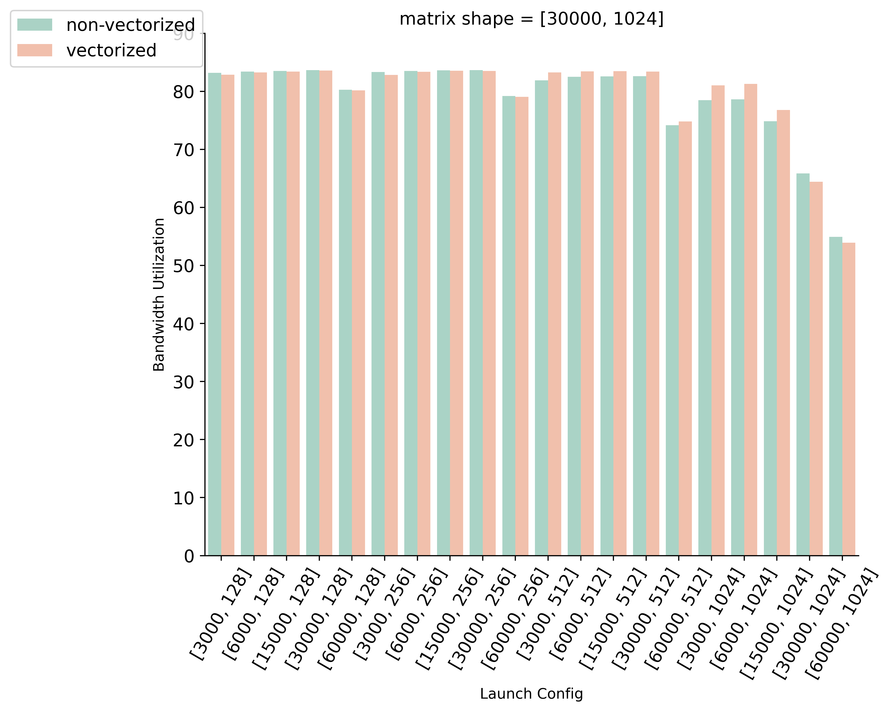
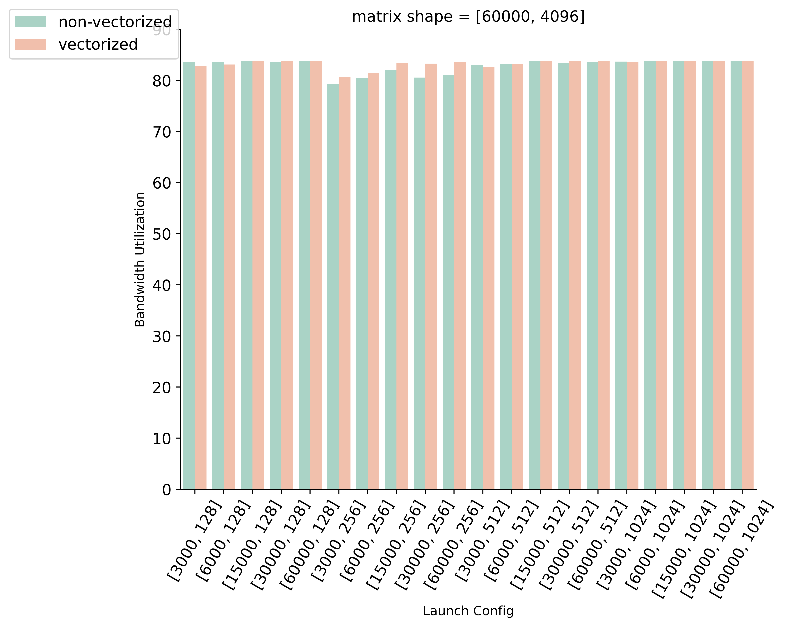

# 测试

输入是一个大小为$[\text{rows}, \text{cols}]$的矩阵，使用固定大小的`grid_size`和`block_size`配置启动kernel。输入放在Global Memory，CTA中的线程合作将输入load到shared memory，再将shared memory中的数据写回另一块在Global Memory上的输出。shared memory大小等于矩阵行的大小。每个CTA处理$\frac{\text{rows}}{\text{grid\_size}}$行输入，每个线程处理$\frac{\text{cols}}{\text{block\_size}}$个数据。在Kernel2中进一步使用向量化指令进行读写。
1. block size 越大，并行线程数越多，每个线程要做的事情越少（这个kernel中需要做的事情只有从global memory读，写shared memory；读shared memory写global memory）。
1. grid size越大，可以并发执行的blocks数越多，留给硬件进行调度。grid size小的时候，一个CTA以**串行**的方式做更多的工作。

|行数|列数|向量化|结果
|:--|:--|:--|:--|
|30000|1024|&#10008;|[link](figures/30000_1024.tsv)|
|30000|1024|&#10004;|[link](figures/30000_1024_vectorized_access.tsv)|
|60000|4096|&#10008;|[link](figures/60000_4096.tsv)|
|60000|4096|&#10004;|[link](figures/60000_4096_vectorized_access.tsv)|

# 背景

Once a threadblock becomes resident on a SM, it stays on that SM until it retires.
This means, for example, that register allocation in the SM register file for a particular resident thread will remain allocated to that thread until that thread completes execution.

There is no context change associated with blocks. Blocks become resident, then stay resident until they retire. There is obviously a preamble block launch cost and a postamble block retirement cost, but these are unpublished and the only way to discover them would be careful microbenchmarking.

1. [Performance cost of too many blocks](https://forums.developer.nvidia.com/t/performance-cost-of-too-many-blocks/67982/8)
1. [Heuristic block size](https://github.com/jaredhoberock/cuda_launch_config)
1. [see the memory section](https://docs.nvidia.com/nsight-compute/ProfilingGuide/index.html#memory-chart)
