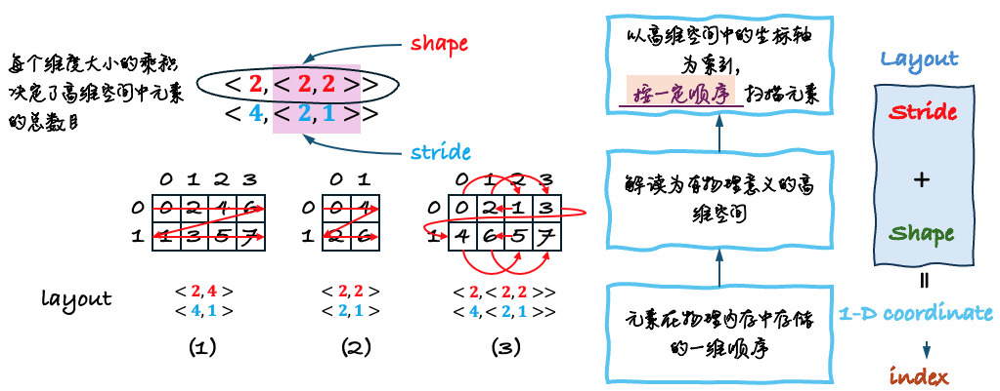
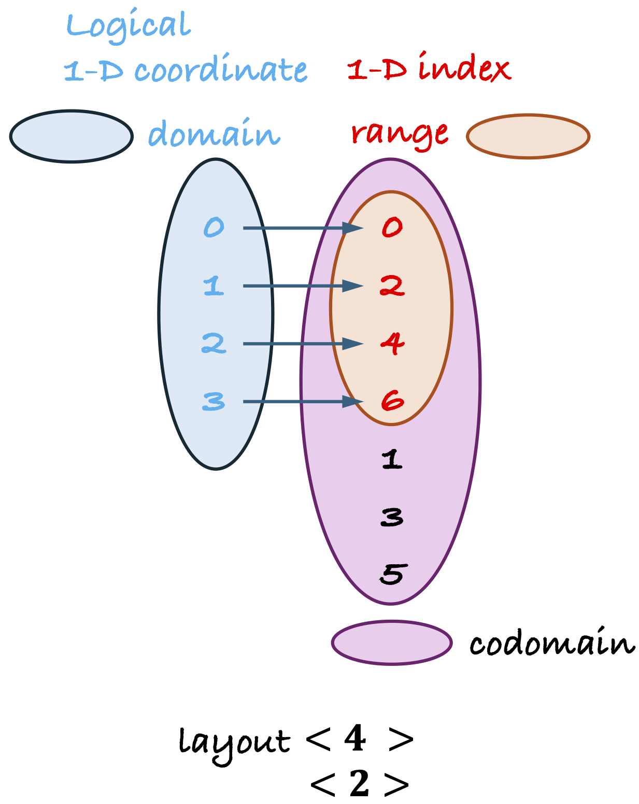

<!-- vscode-markdown-toc -->
- [Layout是什么](#layout是什么)
  - [一个例子](#一个例子)
  - [Layout的本质](#layout的本质)
- [Layout运算](#layout运算)
  - [补](#补)
    - [例子](#例子)
    - [“补”在做什么](#补在做什么)
  - [合成](#合成)
    - [例子](#例子-1)
    - [“合成”在做什么](#合成在做什么)
  - [除](#除)
    - [例子](#例子-2)
- [Reference](#reference)

<!-- vscode-markdown-toc-config
	numbering=true
	autoSave=true
	/vscode-markdown-toc-config -->
<!-- /vscode-markdown-toc -->


# Layout是什么

## 一个例子

我们用`((_2,(_2,_2)):(_4,(_2,_1)))`这个具体的例子来看如何去“思考”嵌套的layout所描述的含义。这个layout由如下C++代码创建。

```cpp
auto layout = make_layout(make_shape(2, make_shape(2, 2)),
                          make_stride(4, make_stride(2, 1)));
print_layout(layout);
```

```bash
(2,(2,2)):(4,(2,1))
     0   1   2   3 
   +---+---+---+---+
0  | 0 | 2 | 1 | 3 |
   +---+---+---+---+
1  | 4 | 6 | 5 | 7 |
   +---+---+---+---+
```

`Layout`由`Shape`和`Stride`两个分量组成：
1. `Shape`用来描述每个轴（CuTe的文档中也叫做mode）的大小
1. `Stride`用来将`Shape`描述的这个高维空间中的坐标（CuTe文档中常用"natural coordinate"这个词）转换为1维坐标。

<p align="center">
<br>
图1. 嵌套((_2,(_2,_2)):(_4,(_2,_1)))示意图
</p>

一种比较易于理解的方式是将指定Layout的过程想象为：元素在物理内存中的存储已经确定，Layout可以指定扫描这些元素的不同顺序。

对`((_2,(_2,_2)):(_4,(_2,_1)))`这个具体的例子，图1是帮助理解这个Layout的示意图。

**我们从最外层向最内层逐层看去**。外层是一个含有两个mode的layout。红色阴影部分所标识的Layout是对第二个mode进一步进行描述，我们先忽略，简单地将第二个mode看作一个整体（一个mode），等价于图1（1）这样的一个Layout。图中纵向是最内层mode，横向是外层mode。<ins>图中***方块格子中的序号是物理内存中元素的存储方式***</ins>，默认在物理内存中存储时，最内层的mode在物理内存中连续，依次向外。<ins>***红色箭头描述的是Layout指定的元素顺序***</ins>。

我们再来看内层嵌套的Layout，如图1（2）所示。这个Layout是对内层mode的进一步细粒度描述。

```bash
Layout b = make_layout(4, 2);

      0   1   2   3 
    +---+---+---+---+
 0  | 0 | 2 | 4 | 6 |
    +---+---+---+---+
```

```bash
size(b) = 4
cosize(b) = 7
```

## Layout的本质

这里我用自己的方式来解释一下cute layout 代数运算中涉及的一些概念。

**Layout的本质是一个形式完全固定的Linear function**，如下图所示，这里我们来看看到底Layout对函数的限制性体现在哪里。

<p align="center">

</p>

当谈论起函数时，势必涉及：domain，range，codomain。

- ***Domain***：是上图中蓝色的集合，是<ins>**从0开始，stride为1的连续变化的整数点集合**</ins>，这是一种一维编址。在很多时候在我们天然的概念模型中，我们要描述的对象，例如1000个浮点数，或者是256个线程，往往有高维结构并且每个维度都有很好的物理含义，如果能用高维数据来描述这些对象，又自动分析工具来完成这个高维和一维编址之间的映射，会极大地改善可编程性。shape描述了一个高维空间中每个维度的大小，于是这些一维整数点能够被解释成高维空间中的**有序点**。高维空间中的点能够用高维空间中的坐标进行枚举。这些点的默认排序的顺序遵循这样的规则：以最左坐标为最速变化，依次类推，遵循字典序。~~这些高维空间中的坐标点集对应的那个顺序就是cute文档中总是会提到的1-D coordinate~~。

- ***线性映射函数***：Layout对应的线性函数的形式已经被完全固定了：上面的整数坐标点与strides进行内积操作。

- ***Range***：domain中的整数点集合通过线性映射函数的作用会被映射到另一个集合（上图橘色部分），这个集合中的整数点就是Range，也就是cute文档中提到的1-D indices。

- ***Codomain***：(用一种我自己较为易于理解的方式）cute中给定整数$M$，从0开始，stride为1连续变化至$M-1$这样生成的整数点集合，看作是一个整数点集合的全集。Codomain就是range中的整数点最大的那个整数点记作$N$，由$N$生成的全集。

这里的take away是：Layout是整数点之上的线性函数。于是我们总是可以用集合和映射的思维来理解各种Layout algebra。
# Layout运算

## 补

我们通过几个具体的例子理解一下Layout的补运算。

首先在集合操作的语境下，给定一个全集和一个指定的集合，补集是指在全集中但是不在指定集合中的元素构成的集合。

### 例子

**Example 1**

```bash
x = (4:1)
y = complement(x, 24) # y = (6:4)
```

Layout x 是下面这样的一个映射函数：

|1-D coordinate|0|1|2|3|
|:--|:--|:--|:--|:--|
|**1-D indices**|0|1|2|3|

Layout x 对24的补是下面这的一个映射函数：

|1-D coordinate|0|1|2|3|4|5|
|:--|:--|:--|:--|:--|:--|:--|
|**1-D indices**|0|4|8|12|16|20|

**Example 2**

```bash
x = (6:4)
y = complement(x, 24) # y = （(4,1):(1,24)）
```

Layout x是下面这样的一个映射函数：

|1-D coordinate|0|1|2|3|4|5|
|:--|:--|:--|:--|:--|:--|:--|
|**1-D indices**|0|4|8|12|16|20|

Layout x对24的补y是下面这样的一个映射函数：
|2-D coordinate|0|
|:--|:--|
|**0**|0|
|**1**|1|
|**2**|2|
|**3**|3|

**Example 3**

```bash
x = (4:2)
y = complement(x, 24) # y = ((2,3):(1,8))
```

Layout x是下面这样的一个映射函数：

|1-D coordinate|0|1|2|3|4|
|:--|:--|:--|:--|:--|:--|
|**1-D indices**|0|2|4|6|8|

Layout x 对24的补是这样的一个映射函数：

||0|1|2|
|:--|:--|:--|:--|
|**0**|0|8|16|
|**1**|1|9|17|

通过上面几个例子，我们可以用下面这种方式，直觉地去理解一个Layout的“补”这样一个抽象运算要完成的事情。我们需要理解这样几件事情：
1. 求Layout x的补集需要指定一个正整数$M$，$M$在这里就指明了全集（整数点0 ~ $M-1$构成的整数点集合）。
1. Layout x的本质是一个函数，将高维空间中的整数点坐标映射为1-D indices。这组indices也是一个集合。

我们对应到数学上补集的概念，Layout x相对于整数$M$的补集是，以$[0, M - 1)$这个整数点集作为全集，以Layout x的range对应的整数点集合，记作$\text{range}(x)$ 作为给定的集合，求$\text{range}(x)$相对于$[0, M-1)$的补集，同时，**这个补集必须以cute的Layout来描述**。但是，Layout是一种形式完全固定住的线性映射，并不能描述任意的点，于是，这里的实际行为是<ins>**用Layout能描述的最多的点**</ins>。

### “补”在做什么

补集总是相对于全集才有意义，“求补”从直觉上可以理解为一种求余的操作，从一个全集的整数点集合中除去一部分，还剩下的那个整数点集合。但是，我们不希望用枚举整个点集的方式描述这个“补集”，于是把这个补集**用一个cute 中的Layout的range集合表示**。

## 合成

我们知道cute中的Layout是一个将一个整数点映射为另一个整数点的函数，那么直接应用函数合成的定义就能理解Layout的合成操作。$A \circ B$就是先对整数点应用函数$B$，再应用$A$。
### 例子

**Example 1**

$20:2 \ \circ \ (4,5):(1,4)$

右边的Layout$(4,5):(1,4)$是下面这样的一个映射函数：

|2-D coordinate|0|1|2|3|4|
|:--:|:--|:--|:--|:--|:--|
|**0**|0|4|8|12|16|
|**1**|1|5|9|13|17|
|**2**|2|6|10|14|18|
|**3**|3|7|11|15|19|

左边的Layout$20:2$是下面这样的一个映射函数：

|1-D coordinate|0|1|2|3|...|19|
|:--|:--|:--|:--|:--|:--|:--|
|**1-D indices**|0|2|4|6|...|38|

$C=A\circ B$对应的映射函数如下表所示：

|2-D coordinate|0|1|2|3|4|
|:--:|:--|:--|:--|:--|:--|
|**0**|0|8|16|24|32|
|**1**|2|10|18|26|34|
|**2**|4|12|20|28|36|
|**3**|6|14|22|30|38|

表示为：$(4,5):(2,8)$

**Example 2**

$(20,2):(16,4)\ \circ (4,5):(1:4)$

右边的Layout$(4,5):(1,4)$和Example 1相同，没有改变。左边的Layout$(20,2):(16,4)$是下面这样的一个映射函数：

|2-D coordinate|0|1|
|:--:|:--|:--|
|**0**|0|4|
|**1**|16|20|
|**2**|32|36|
|**3**|48|52|
|**4**|64|68|
|$\vdots$||
|**19**|304|308|

$C=A\circ B$对应的映射函数如下表所示：

|2-D coordinate|0|1|2|3|4|
|:--:|:--|:--|:--|:--|:--|
|**0**|0|64|128|192|256|
|**1**|16|80|144|208|272|
|**2**|32|96|160|224|288|
|**3**|48|112|176|240|304|

表示为：$(4:5):(16:64)$

### “合成”在做什么

**Layout合成操作$C=A \circ B$中，最右边的函数$B$的domain决定了最终结果$C$的domain**。最左边的Layout的range集合决定了最终结果C的range集合。

## 除

cute的文档中定义了三种除法，`logical_divide`，`zipped_divide`和`tiled_divide`。

其中`logical_divide`的计算过程给出了定义，如下：$$\text{logical\_divide}(a, b) = \text{composition}(a, \text{make\_layout}(b, \text{complement}(b, \text{size}(a))))$$

我们可以用直觉理解来解释一下两个Layout进行`logical_divide`运算，到底在做什么：

1. 首先“补”操作求出来除数Layout b对被除数a的余数，结果被一个Layout表示，记作v1。
1. 第二步，`v2 = make_layout(b, v1)`创建了一个嵌套的Layout，这个嵌套的Layout将b排在mode 0，将余数v1排在mode 1。
1. 第三步，用被除数`a`与`v2`进行函数的合成，结果v，就是除法的结果。由于v是由合成操作得到的一个Layout，`a`的domain就是`v`的domain，`v2`的range~~就是`v`的range~~（这里不太对，要对stride向量进行合成）。

### 例子

**Example 1**

```bash
a = (24:2)
b = (4:2)
c = x / y # (4,(2,3)):(4,(2,16))
```

被除数（分母） Layout a：`(24:2)`

|1-D coordinate|0|1|2|...|23|
|:--|:--|:--|:--|:--|:--|
|**1-D indices**|0|2|4|...|46|

除数（分字）Layout b: `(4:2)`

|1-D coordinate|0|1|2|3|
|:--|:--|:--|:--|:--|
|**1-D indices**|0|2|4|6|

商 `(4,(2,3)):(4,(2,16))`：

在写出上面的嵌套Layout之前，我们先看一下内层嵌套的 `(2,3):(2:16)`对应的映射函数，如下：

||0|1|2|
|:--|:--|:--|:--|
|**0**|0|16|32|
|**1**|2|18|34|

两个Layout相除得到的商也是一个映射函数，如下：

||0|1|2|3|4|5|
|:--|:--|:--|:--|:--|:--|:--|
|**0**|0|2|16|18|32|34|
|**1**|4|6|20|22|36|38|
|**2**|8|10|24|26|40|42|
|**3**|12|14|28|30|44|46|

除法是将一个数分解为两个因数的过程。

1. 首先计算除数 Layout b:`(4:2)`对于`size(a) = 24`的补集，记作Layout $v_1$。

    |`(4:2)`|0||2||4||6||||||
    |:--|:--|:--|:--|:--|:--|:--|:--|:--|:--|:--|:--|:--|
    |size(a)生成的整数点集|0|1|**&#10005;**|3|**&#10005;**|5|**&#10005;**|7|8|9|...|23|

    有了上文对Layout补的解释，我们可以知道首先取出来Layout b的range对应的整数点集合记作$B$，然后用`size(a)`生成一个整数点的全集记作$A$，求$B$对于$A$的补集，记作$C$，然后寻找一个线性映射，他的range集合能够表示最多个$C$中的元素。
    
    也就是在上表中，**用一个Layout表示尽可能多的没有被划掉的元素**。通过观察，这个Layout 的range集合包含的整数点的形式和顺序（整数点集合是有序的）包括：`0, 1, 8, 9, 16, 17, ...`，写作：$(2,3):(1,8)$。

    ||0|1|2|
    |:--|:--|:--|:--|
    |**0**|0|8|16|
    |**1**|1|9|17|

1. 将补集与除数b进行嵌套，得到Layout：$v_2 = ((4,(2,3)):(2,(1,8))$。

    ||0|1|2|3|4|5|
    |:--|:--|:--|:--|:--|:--|:--|
    |**0**|0|1|8|9|16|17|
    |**1**|2|3|10|11|18|19|
    |**2**|4|5|12|13|20|21|
    |**3**|6|7|14|15|22|23|

1. 把Layout $v_2$与被除数$a$进行合成

    ||0|1|2|3|4|5|
    |:--|:--|:--|:--|:--|:--|:--|
    |**0**|0|2|16|18|32|34|
    |**1**|4|6|20|22|36|38|
    |**2**|8|10|24|26|40|42|
    |**3**|12|14|28|30|44|46|

# Reference

1. [CUTLASS 3 0 Next Generation Composable and Reusable GPU Linear Algebra Library - TVMCon2023](https://www.youtube.com/watch?v=QLdUML5MCfE)
1. A Generalized Micro-kernel Abstraction for GPU Linear Algebra: [[slides]](https://www.cs.utexas.edu/users/flame/BLISRetreat2023/slides/Thakkar_BLISRetreat2023.pdf): [[video]](https://www.youtube.com/watch?v=muvkCPy3UDE)
1. [Graphene: An IR for Optimized Tensor Computations on GPUs](https://dl.acm.org/doi/pdf/10.1145/3582016.3582018)
1. 知乎系列文章
    - [cute Layout 的代数和几何解释](https://zhuanlan.zhihu.com/p/662089556)
    - [cute 之 Tensor](https://zhuanlan.zhihu.com/p/663093816)
    - [cute 之 MMA抽象](https://zhuanlan.zhihu.com/p/663092747)
    - [cute 之 Copy抽象](https://zhuanlan.zhihu.com/p/666232173?utm_psn=1707515359807221761)
1. [BLIS](https://github.com/flame/blis#what-people-are-saying-about-blis)
1. 关于Tensor Core的ldmatrix指令
    - https://www.zhihu.com/question/600927104/answer/3029266372
    - https://docs.nvidia.com/cuda/parallel-thread-execution/index.html#warp-level-matrix-fragment-mma-1688
    - https://docs.nvidia.com/cuda/parallel-thread-execution/index.html#warp-level-matrix-instructions-ldmatrix
