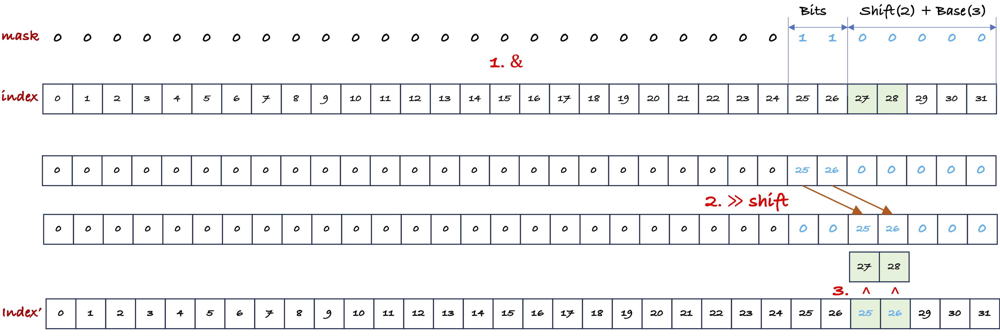

<!-- vscode-markdown-toc -->
- [Swizzle](#swizzle)
  - [swizzle\<bits, base, shift\>](#swizzlebits-base-shift)
  - [swizzle\<2,0,3\>](#swizzle203)
  - [更多例子](#更多例子)
    - [改变base](#改变base)
  - [补充：两个十进制整数的异或](#补充两个十进制整数的异或)
- [Reference](#reference)

<!-- vscode-markdown-toc-config
	numbering=true
	autoSave=true
	/vscode-markdown-toc-config -->
<!-- /vscode-markdown-toc -->

# Swizzle

swizzle是一个重排序函数，与row major或者column major这样的layout进一步compose。

## swizzle<bits, base, shift>

swizzle函数对给定整数index，输出映射后的index，在内部运算时，使用输入index的二进制表示参与swizzle函数的计算。

```python
def shiftr(a, s):
    return a >> s if s > 0 else shiftl(a, -s)

def shiftl(a, s):
    return a << s if s > 0 else shiftr(a, -s)

# swizzle(bits, base, shift) <-- 首先定义swizzle的参数
bit_msk = (1 << bits) - 1
yyy_msk = bit_msk << (base + max(0, shift))
zzz_msk = bit_msk << (base - min(0, shift))

# 给定offset，计算这个offset被移动到哪里
return offset ^ shiftr(offset & yyy_msk, shift)
```

- **$\text{bits}$**: mask含有的bit数。给定bits和shift收，首先计算出$YYY \text{mask}$。
    - $YYY\ \text{mask}$ 长 `bits + base + shift`位，前 `bits` 位全1，后 `base + shift`位全为0。
    - 程序中$YYY\ \text{mask}$用一个32位整数表示，$[0, \text{bits} + \text{base} + \text{shift})$位全部是0。
- **$\text{base}$**: $2^{\text{base}}$在index的二进制表示中，最后2个bit保持不变。
- **$\text{shift}$**: $YYY \text{mask}$移动的距离。在二进制计算中将`bits`左移`shift`位置。

swizzle函数的计算包含三步：

1. v1 = index 的二进制表示与$YYY \text{mask}$相与
2. v2 = v1 的二进制表示右移shift位
3. index 与 v2 进行异或

swizzle<2,2,3>的计算过程如下图所示：

>注意：**一个二进制数与全0 **and** 会被置为0，与全1 **and** 保持不变，与全0 **xor** 保持不变。**

<p align="center">
<br>
swizzle函数
</p>

相当于把上图绿色方框对应的两组比特位进行了反转。

## swizzle<2,0,3>

以`swizzle<2,0,3>`这个swizzle函数为例: bits = 2, base = 0, shift = 3。bits = 2 对应mask为 `11`，$YYY \text{mask}$是将mask `11`左移3位：`11000`

**给定 index = 8，我们来计算8会被移动到哪里？8的二进制表示为：1000。**

1. 1000 & $YYY \text{mask}$ = 1000 & 11000 = 1000
2. 1000 >> shift = 1
3. 1 ^ index = 0001 ^ 1000 = 1001

**给定 indxe = 9, 我们来计算9会被移动到哪里？9的二进制表示：1001。**

1. 1001 & $YYY \text{mask}$ = 1001 & 11000 = 1000
1. 1000 >> shift = 1
1. 1 ^ index = 0001 ^ 1001 = 1000

连续 0 ~ 31 以$4 \times 8$行优先形状存储，在`Swizzle(2, 0, 3)`映射下，重排序结果如下：

||*0*|*1*|*2*|*3*|*4*|*5*|*6*|*7*|
|:--|:--|:--|:--|:--|:--|:--|:--|:--|
|***0***|0|1|2|3|4|5|6|7|
|***1***|9|8|11|10|13|12|15|14|
|***2***|18|19|16|17|22|23|20|21|
|***3***|27|26|25|24|31|30|29|28|

## 更多例子

我们通过例子来观察一下以上的位运算反映到宏观层面的直觉含义。$8 \times 8$个元素以行优先组织。

### 改变base

swizzle(2, 0, 3)

||*0*|*1*|*2*|*3*|*4*|*5*|*6*|*7*|
|:--|:--|:--|:--|:--|:--|:--|:--|:--|
|***0***|0|1|2|3|4|5|6|7|
|***1***|9|8|11|10|13|12|15|14|
|***2***|18|19|16|17|22|23|20|21|
|***3***|27|26|25|24|31|30|29|28|
|***4***|32|33|34|35|36|37|38|39|
|***5***|41|40|43|42|45|44|47|46|
|***6***|50|51|48|49|54|55|52|53|
|***7***|59|58|57|56|63|62|61|60|

swizzle(2, 1, 3)

||*0*|*1*|*2*|*3*|*4*|*5*|*6*|*7*|
|:--|:--|:--|:--|:--|:--|:--|:--|:--|
|***0***|0|1|2|3|4|5|6|7|
|***1***|8|9|10|11|12|13|14|15|
|***2***|18|19|16|17|22|23|20|21|
|***3***|26|27|24|25|30|31|28|29|
|***4***|36|37|38|39|32|33|34|35|
|***5***|44|45|46|47|40|41|42|43|
|***6***|54|55|52|53|50|51|48|49|
|***7***|62|63|60|61|58|59|56|57|

swizzle(2, 2, 3)

||*0*|*1*|*2*|*3*|*4*|*5*|*6*|*7*|
|:--|:--|:--|:--|:--|:--|:--|:--|:--|
|***0***|0|1|2|3|4|5|6|7|
|***1***|8|9|10|11|12|13|14|15|
|***2***|16|17|18|19|20|21|22|23|
|***3***|24|25|26|27|28|29|30|31|
|***4***|36|37|38|39|32|33|34|35|
|***5***|44|45|46|47|40|41|42|43|
|***6***|52|53|54|55|48|49|50|51|
|***7***|60|61|62|63|56|57|58|59|

swizzle(2, 3, 3)

||*0*|*1*|*2*|*3*|*4*|*5*|*6*|*7*|
|:--|:--|:--|:--|:--|:--|:--|:--|:--|
|***0***|0|1|2|3|4|5|6|7|
|***1***|8|9|10|11|12|13|14|15|
|***2***|16|17|18|19|20|21|22|23|
|***3***|24|25|26|27|28|29|30|31|
|***4***|32|33|34|35|36|37|38|39|
|***5***|40|41|42|43|44|45|46|47|
|***6***|48|49|50|51|52|53|54|55|
|***7***|56|57|58|59|60|61|62|63|

$2^\text{base}$个数字为一组，swizzle函数并不会改变组内元素的顺序。

## 补充：两个十进制整数的异或

这个[帖子](https://stackoverflow.com/questions/6398427/what-does-bitwise-xor-exclusive-or-mean/16285195#16285195?newreg=29481acdc3404feebe3d6cdad341f919)很好地解释了两个十进制整数异或的含义。

|十进制|二进制|二进制到十进制转换|
|:--|:--|:--:|
|0|0000|0|
|1|0001|1|
|2|0010|2|
|3|0011|2+1|
|4|0100|4|
|5|0101|4+1|
|6|0110|4+2|
|7|0111|4+2+1|
|8|1000|8|
|9|1001|8+1|
|10|1010|8+2|
|11|1011|8+2+1|
|12|1100|8+4|
|13|1101|8+4+1|
|14|1110|8+4+2|
|15|1111|8+4+2+1|

计算 2 ^ 3：2 = 2, 3 = 1 + 2。2 是 3 的component，2 ^ 3 就是从3中减去2，于是等于1。

计算 6 ^ 8：6 = 4 + 2，8 = 8。6 不是8的component，6 ^ 8 就是给8加上6，于是等于14。

# Reference

1. [What does bitwise XOR (exclusive OR) mean?](https://stackoverflow.com/questions/6398427/what-does-bitwise-xor-exclusive-or-mean)
1. [DEVELOPING CUDA KERNELS TO PUSH TENSOR CORES TO THE ABSOLUTE LIMIT ON NVIDIA A100](https://developer.download.nvidia.com/video/gputechconf/gtc/2020/presentations/s21745-developing-cuda-kernels-to-push-tensor-cores-to-the-absolute-limit-on-nvidia-a100.pdf)
