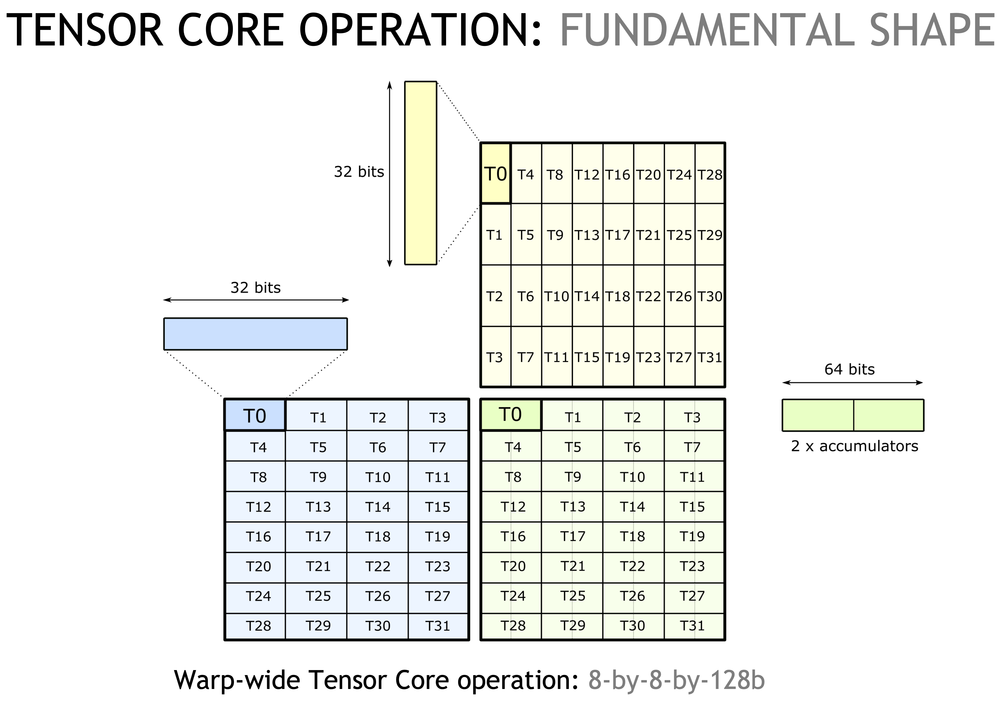
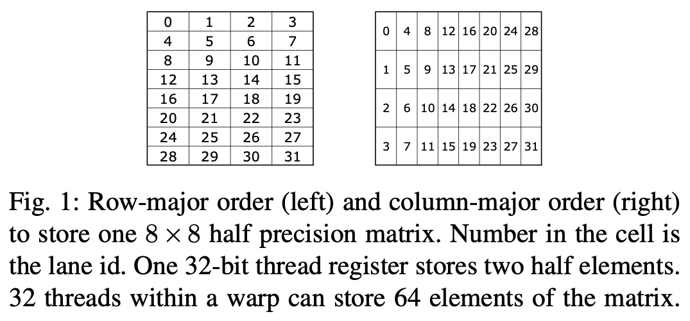
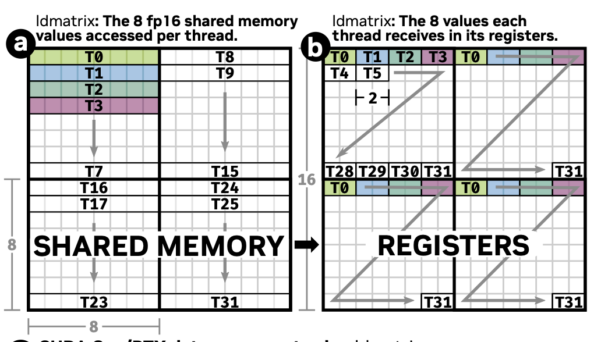

```cpp
/*

// length is 32, since there are 32 banks in a shared memory cache line

A generic Swizzle functor
0bxxxxxxxxxxxxxxxYYYxxxxxxxZZZxxxx 
                              ^--^ MBase is the number of least-sig bits to keep constant
                 ^-^       ^-^     BBits is the number of bits in the mask
                   ^---------^     SShift is the distance to shift the YYY mask
                                      (pos shifts YYY to the right, neg shifts YYY to the left)

e.g. Given
0bxxxxxxxxxxxxxxxxYYxxxxxxxxxZZxxx
the result is
0bxxxxxxxxxxxxxxxxYYxxxxxxxxxAAxxx where AA = ZZ xor YY
*/

template <int BBits, int MBase, int SShift = BBits>
struct Swizzle{
    // ...
}
```

```bash
row major: 
0, 1, 2, 3, 4, 5, 6, 7, 
8, 9, 10, 11, 12, 13, 14, 15, 
16, 17, 18, 19, 20, 21, 22, 23, 
24, 25, 26, 27, 28, 29, 30, 31,

swizzled layout: 
0, 1, 2, 3, 4, 5, 6, 7, 
9, 8, 11, 10, 13, 12, 15, 14, 
18, 19, 16, 17, 22, 23, 20, 21, 
27, 26, 25, 24, 31, 30, 29, 28,
```

## Tensor Core

>V100中Tensor Core可以聚合的操作八个线程的寄存器，A100则可以操作32个线程的所有寄存器。“A100's enhanced 16x8x16 Tensor Core (TC) instructions improve on V100 by reducing register accesses from 80 to 28, and hardware instructions issued from 16 to 2”

如下图所示，$8 \times 8 \times 128b$ ($m = 8, n = 8, k = 128 \text{b}$) 这样的一个矩阵乘形状是tensor core mma指令的一个基本building block。
 
<p align="center">
<br>
Fig. 1 出自 Ref 3.
</p>

一个warp 内的32线程总是以$4 \times 8$排布进行组织，$4$总是分布在内存中的连续维度之上。上图可以看出

## Swizzle 和 ldmatrix 指令

一个$32\text{bit}\ (4 \text{byte})$寄存器可以存储2个半精度浮点数，一个warp 32线程的32-bit寄存器正好可以存储一个$8 \times 8$半精度矩阵 （$32 \times 4 = 128 \ \text{bytes}$ 数据。$8 \times 8 \times 16 / 8 = 128 \ \text{bytes}$），可以被一个warp的32-bit寄存器下，然后用一个index进行数据的寻址。

Tensor core 编程打破了原先CUDA programming model中每个线程寄存器数据是私有的这一情况。Tensor core的MMA指令能同时操作所有lane上的寄存器，所有lane上的寄存器拼在一起存储了一块完整的矩阵乘。
那么下面一个问题是，这个$8 \times 8$矩阵在lanes中是如何scatter的？

tensor core的mma指令要求矩阵乘操作数$A$是行有先，$B$列优先，$C$行优先。$8 \times 8$的矩阵可以行优先或者列优先，两种情况下与lane id对应关系如图1所示。

<p align="center">
<br>
Fig 2. lane ID 与矩阵元素之间的对应关系（出自Ref 6）。
</p>

<p align="center">

</p>

>the ldmatrix instruction uses a warp (32 threads) to move up to four 8 × 8 matrices from shared memory into the registers of the warp’s threads.

1. 每个线访问连续128b数据，shared memory memory transaction位宽是1024b，8线程的一次访问shared memory构成一个访存事物。一个warp 32线程的访问分为4个阶段，每8线程构成一个阶段，shared memory bank conflict发生在这8个线程之中。
2. 每个线程访问128数据（8个半精度），`ldmatrix` 指令由一个warp中32个线程协作参与完成，一次执行能够scatter 4个$8 \times 8$的半精度矩阵到lane上的私有寄存器，lane上的寄存器拥有数据的格式如上图右所示。而tensor core指令能直接聚合32个寄存器。


执行`ldmatrix`指令，一个warp中的32个线程在一个时钟周期协作加载4个$8 \times 8$大小的半精度矩阵。
每个线程会给一个指向128b数据的指针，这个指针会被broadcast给四个线程。

# Reference

1. [swizzling modes](https://docs.nvidia.com/cuda/parallel-thread-execution/index.html#swizzling-modes)
1. [Nvidia Tensor Core-CUDA HGEMM Advanced Optimization](https://bruce-lee-ly.medium.com/nvidia-tensor-core-cuda-hgemm-advanced-optimization-5a17eb77dd85)
1. [DEVELOPING CUDA KERNELS TO PUSH TENSOR CORES TO THE ABSOLUTE LIMIT ON NVIDIA A100](https://developer.download.nvidia.com/video/gputechconf/gtc/2020/presentations/s21745-developing-cuda-kernels-to-push-tensor-cores-to-the-absolute-limit-on-nvidia-a100.pdf)
1. https://github.com/nicolaswilde/cuda-tensorcore-hgemm/tree/master
1. [Warp-level matrix load instruction: ldmatrix](https://docs.nvidia.com/cuda/parallel-thread-execution/index.html#warp-level-matrix-instructions-ldmatrix)
1. [Demystifying Tensor Cores to Optimize Half-Precision Matrix Multiply](https://www.cse.ust.hk/~weiwa/papers/yan-ipdps20.pdf)
1. [NVIDIA A100 Tensor Core GPU Architecture](https://images.nvidia.com/aem-dam/en-zz/Solutions/data-center/nvidia-ampere-architecture-whitepaper.pdf#cid=_pa-srch-baid_zh-cn)
1. https://www.zhihu.com/question/587780273/answer/2929756314
