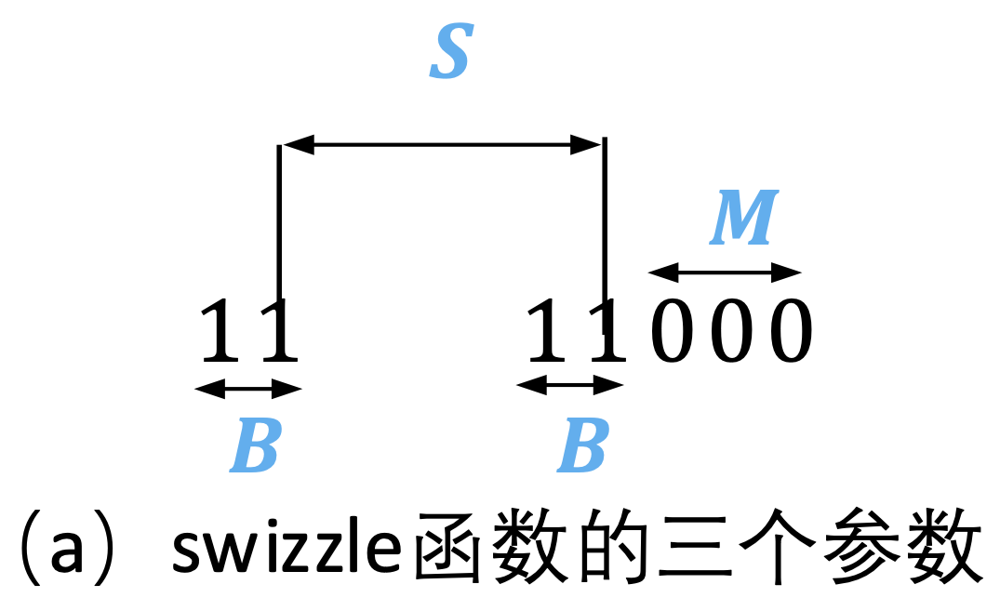
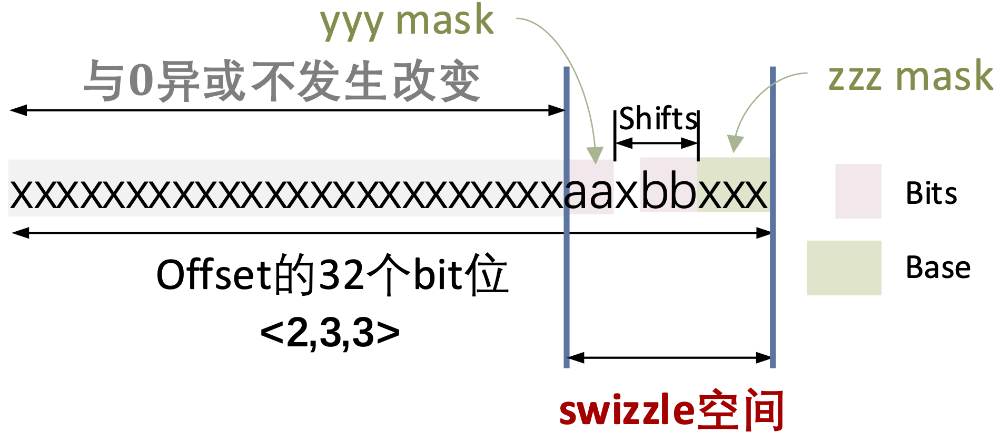
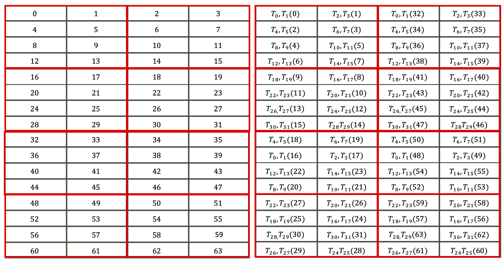

## 一个generic swizzle函数

对一个二维空间的行和列进行swizzle $\text{swizzle}(B,M,S)$：

- $2^M$ 个元素为一组
- swizzle的二维空间有 $2^B$ 行
- swizzle的二维空间中 $2^S$ 个元素为一列

每个线程用向量化指令访问128b数据，$128 / 32 = 4 \ \text{bank}$，每个线程访问4个bank，8个线程访问一条shared memory cache line。

1. 当数据类型是半精度时，$M=3$，因为$2^3=8 \times 16 = 128 \ \text{b}$，128-bit 访存指令读取8个元素，这些元素为一组。
1. $S = 3$，1024 / 128 = 8，8个线程访问一整条shared memory cache line
1. 假如原始输入数据有形状，在内存中连续的维度是64，并且数据类型为半精度，$64 \times 16 / 1024 = 1$，一个连续维度就占1个shared memory cache line。

## swizzle<2, 3, 3>的计算过程

swizzle<2, 3, 3>的计算过程如下：

`Bits=2, MBase=3, Shifts=3` 这样一个swizzle函数的计算过程：

1. **bits掩码**：根据`Bits`计算一个掩码：`bit_mask = (1 << Bits) - 1`，Bits是几，掩码就由几个1构成。例如，Bits=3，掩码为`111`。
<!-- 2. Bits的长度决定了swizzle的二维空间中的列数为：$2^{\text{bits}}$。 -->

1. **yyy_mask和zzz_mask**：计算`yyy_mask`和`zzz_mask`。假设`MBase=3`，那么会有3个比特位保持不改变。将`Bits`个bit位左移`MBase`是zzz_mask，将`Bits`个bit位左移`MBase` + `Shifts`位是yyy_mask。

    $\text{yyy\_mask}$和$\text{zzz\_mask}$决定了swizzle二维空间中要去交换的两个位置。

 
Fig. swizzle函数位运算示意

 
Fig. 原始的offset和swizzled offset之间的关系

1. **permute输入**：`offset ^ shiftr(offset & self.yyy_msk, self.shift)`

   1. offset的二进制表示与`yyy_mask`相与，右移`Shifts`位，结果记作offset1；offset1是将offset中$\text{yyy\_mask}$对应位置的bit位保留原值，其余位置清零，然后取出来的部分移动到$\text{zzz\_mask}$所在的位置。
   2. offset与offset1进行异或。一个bit位与0异或结果不变，结果相当于offset中$\text{yyy\_mask}$对应的bit位offset中$\text{zzz\_mask}$对应的bit位进行异或，写入$\text{zzz\_mask}$对应的位置

## 对16x16数据块进行swizzle

有一个16x16的数据块，进一步以$1 \times 8$为粒度被分成了$16 \times 2$个块（**这里我们先模糊行优先/列优先，具体对应到行优先/列优先时，只需要对这两个维度做相应的调整和适配**）。我们的目标是将这个$16 \times 16$的数据块以bank-conflict free的方式存储在shared memory中。

这里我们考虑以下假设：

1. 将GPU的shared memory看作由8个bank构成，于是每个bank位宽128 bits，正好对应了上面提到的大小为$1\times 8$的一段数据；
1. 数据是以半精度存储，于是$1024/16=64$个半精度正好存储在一条shared memory cache line里面
1. 单线程访问128bit，于是8线程并发访存一次的数据恰好可以写入一整行shared memory cache line，而这一点是我们需要保证的，这八个线程写入shared memory的bank id必须是0~8这个8个bank id的一个permutation，不可以落入同一个bank。

 
Fig. <2,3,3>设置下shared memory的逻辑编号

$<B=2,M=3,S=3>$这样一个swizzle函数会对：$2^2*2^3*2^3=4*8*8=16*16=256$个元素进行permute，也就是恰好对16x16的半精度进行permute。

下表是swizzle函数要去操作的bit位，红色位置的bit位进行异或（后三位总是当成是一个元素）。

|-|-|-|x|x|-|-|-|
|:--|:--|:--|:--|:--|:--|:--|:--|
|**x**|**x**|-|-|-|**-**|**-**|**-**|

Bits=2决定了bank id用2个bit位表示，也就是shared memory的8个bank被分成了两组。

|xor|00|01|10|11|
|:--|:--|:--|:--|:--|
|**00**|00|01|10|11|
|**01**|01|00|11|10|
|**10**|10|11|00|01|
|**11**|11|10|01|00|

从上面这个表是$B=2$时的异或表，可以看到异或具有封闭性；

swizzle的二维index空间中共有$2^2\times 2^3=4\times8=32$个坐标，我们在下表中表示中这个swizzle空间中所有index的十进制（上方）和对应的二进制（下方）：

|0 000000|1 00001|2 00010|3 00011|4 00100|5 00101|6 00110|7 00111|
|:--:|:--:|:--:|:--:|:--:|:--:|:--:|:--:|
|8 01000|9 01001|10 01010|11 01011|12 01100|13 01101|14 01110|15 01111|
|16 10000|17 10001|18 10010|19 10011|20 10100|21 10101|22 10110|23 10111|
|24 11000|25 11001|26 11010|27 11011|28 11100|29 11101|30 11110|31 11111|

swizzled index（**下面的表格用红色和黑色将数据分成了两部分，可以看出来换序仅仅发生在同色的数据块之内**）：

|bank-id|0|1|2|3|4|5|6|7|
|:--|:--|:--|:--|:--|:--|:--|:--|:--|
|**Access-0**|0|1|2|3|4|5|6|7|
|**Access-1**|9|8|11|10|13|12|15|14|
|**Access-2**|18|19|16|17|22|23|20|21|
|**Access-3**|27|26|25|24|31|30|29|28|

 
Fig. 以Global Memory上row major的16x16数据块为源，线程分数据方式以及shared memory中数据存储顺序，线程Layout: ColMajor<16, 2>；

 
Fig. 以Global Memory上row major的16x16数据块为源，线程分数据方式以及shared memory中数据存储顺序，线程Layout：RowMajor<16, 2>；

<!-- |0 |1|32|33|
|:--|:--|:--|:--|
|2|3|34|35|
|4|5|36|37|
|6|7|38|39|
|9|8|41|40|
|11|10|43|42|
|13|12|45|44|
|15|14|47|46|
|18|19|50|51|
|16|17|48|49|
|22|23|54|55|
|20|21|52|53|
|27|26|59|58|
|25|24|57|56|
|31|30|63|62|
|29|28|61|60| -->

|[original, new]|[original, new]|[original, new]|[original, new]|
|:--:|:--:|:--:|:--:|
[0, 0]|[1, 1]|[2, 32]|[3, 33]|
[4, 2]|[5, 3]|[6, 34]|[7, 35]|
[8, 4]|[9, 5]|[10, 36]|[11, 37]|
[12, 6]|[13, 7]|[14, 38]|[15, 39]|
[16, 9]|[17, 8]|[18, 41]|[19, 40]|
[20, 11]|[21, 10]|[22, 43]|[23, 42]|
[24, 13]|[25, 12]|[26, 45]|[27, 44]|
[28, 15]|[29, 14]|[30, 47]|[31, 46]|
[32, 18]|[33, 19]|[34, 50]|[35, 51]|
[36, 16]|[37, 17]|[38, 48]|[39, 49]|
[40, 22]|[41, 23]|[42, 54]|[43, 55]|
[44, 20]|[45, 21]|[46, 52]|[47, 53]|
[48, 27]|[49, 26]|[50, 59]|[51, 58]|
[52, 25]|[53, 24]|[54, 57]|[55, 56]|
[56, 31]|[57, 30]|[58, 63]|[59, 62]|
[60, 29]|[61, 28]|[62, 61]|[63, 60]|

计算swizzle的过程中：

1. 每个线程首先根据自己的thread index，得到自己在二维线程组织中的行号和列号：`lane_row`和`lane_col`；
1. 根据`lane_row`和`lane_col`以及单线程访问多少个元素可以计算出`16x16`这个base tile形状定义的二维坐标空间中的行号和列号$i$和$j$；
1. $i$和$j$进一步转换为0 ~ 255($16 \times 16 = 255$)之间的一个1维编号，这个编号带入swizzling函数，得到permute之后的1维编号$s$;
1. $s$再次转换为0 ~ 255之间的1维编号；

这里我们假设shared memory一个bank位宽128-bit。shared memory cache line含有8个bank。一个BaseTile的起始地址对齐到shared memory的bank 0。下图每一个小方格是128 bits数据，由两个线程写入shared memory中一个bank。

上图红色方框圈起来的是一条 shared memory cache line。register-to-shared store的时候由16个线程写入同一条shared memory cache line。shared-to-global store的时候由8个线程读取。

# Reference

1. [What does bitwise XOR (exclusive OR) mean?](https://stackoverflow.com/questions/6398427/what-does-bitwise-xor-exclusive-or-mean)
1. [DEVELOPING CUDA KERNELS TO PUSH TENSOR CORES TO THE ABSOLUTE LIMIT ON NVIDIA A100](https://developer.download.nvidia.com/video/gputechconf/gtc/2020/presentations/s21745-developing-cuda-kernels-to-push-tensor-cores-to-the-absolute-limit-on-nvidia-a100.pdf)
1. [cute 之 Swizzle](https://zhuanlan.zhihu.com/p/671419093)
