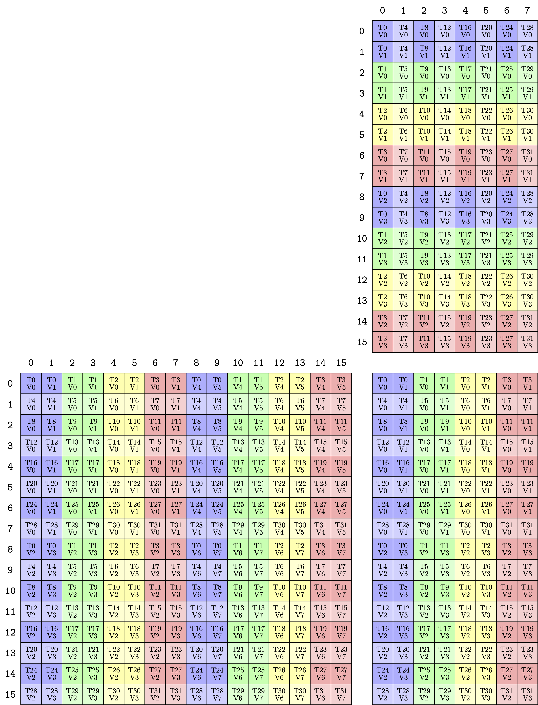
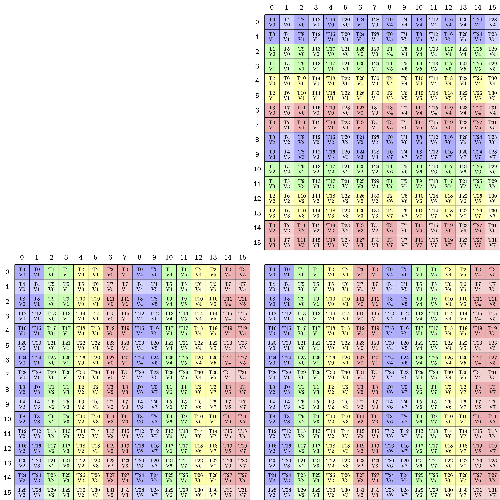

## Ampere

### Atomic MMA Layout

```cpp
 using TiledMma = TiledMMA<MMA_Atom<SM80_16x8x16_F32F16F16F32_TN>,
                           Layout<Shape<_1, _1, _1>>,
                           Tile<_16, _8, _16>>;
```

<p align="center">
<br>
Layout for MMA declared above for Ampere.
</p>

### Expanded MMA Layout
```cpp
 using TiledMma = TiledMMA<MMA_Atom<SM80_16x8x16_F32F16F16F32_TN>,
                           Layout<Shape<_1, _1, _1>>,
                           Tile<_16, _16, _16>>;
```

<p align="center">
<br>
Layout for MMA declared above for Ampere.
</p>


## Reference

1. https://github.com/NVIDIA/cutlass/discussions/1345
