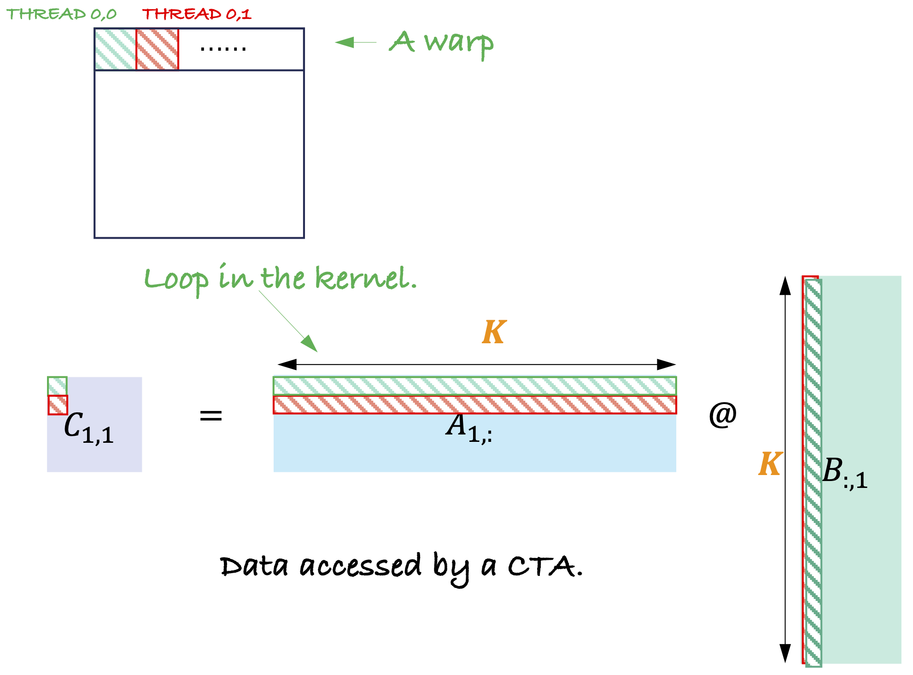
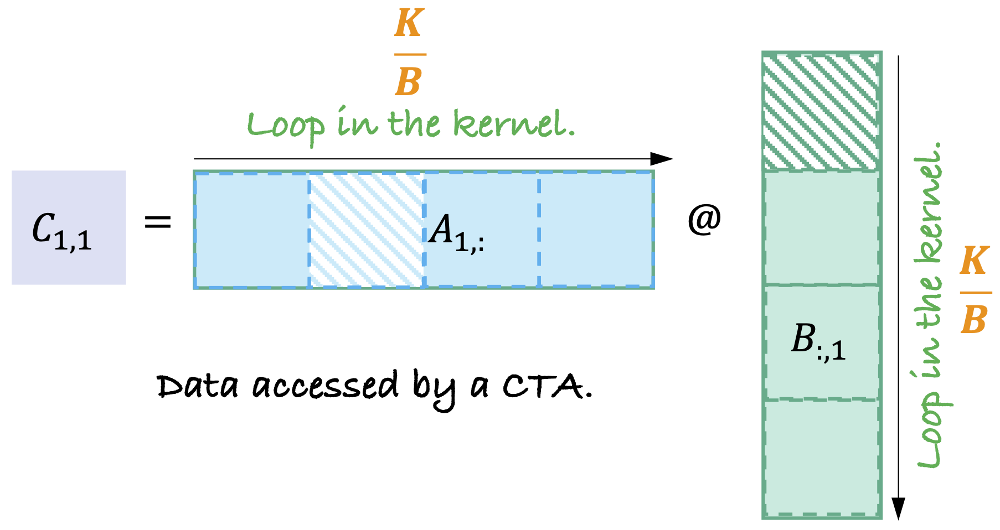

<!-- START doctoc generated TOC please keep comment here to allow auto update -->
<!-- DON'T EDIT THIS SECTION, INSTEAD RE-RUN doctoc TO UPDATE -->
**Table of Contents**  *generated with [DocToc](https://github.com/thlorenz/doctoc)*

- [Matrix Multiplication on GPUs](#matrix-multiplication-on-gpus)
  - [Background](#background)
  - [Hierarchical Partition and Data Movements](#hierarchical-partition-and-data-movements)
    - [Blocking for Thread Blocks (TBs) and Shared Memory](#blocking-for-thread-blocks-tbs-and-shared-memory)
    - [Blocking for Warps and Register File](#blocking-for-warps-and-register-file)
  - [Optimize Matrix Multiplication Step by Step](#optimize-matrix-multiplication-step-by-step)
    - [1. The Naive Kernel](#1-the-naive-kernel)
    - [2. Global Memory Coalescing](#2-global-memory-coalescing)
    - [3. Shared Memory Blocking](#3-shared-memory-blocking)
- [Reference](#reference)

<!-- END doctoc generated TOC please keep comment here to allow auto update -->

# Matrix Multiplication on GPUs

These kernel implementations are from this Github repo: [How to optimize SGEMM on NVIDIA GPUs](https://github.com/yzhaiustc/Optimizing-SGEMM-on-NVIDIA-Turing-GPUs).

## Background

$$C[m,n] = \alpha\left( \sum_{k}A[m,k] * B[k,n] \right) + \beta C[m,n]$$

Challenges for an efficient implementation of matrix multiplication on GPUs:

1. high-strided memory
1. insufficient data reuse

A straightforward implementation of GEMM uses three nested loops:

```c++
for (int k = 0; k < K; ++k) {
    for (int i = 0; i < M; ++i) {
        for (int j = 0; j < N; ++j) {
            C[i, j] += A[i, k] * B[k, j];
        }
    }
}
```

It is observable that <u>**each induction variable will occur in precisely two out of the three tensors. Each induction variable represents a reuse dimension for exactly one of the three tensors, the tensor that is not indexed by it**</u>.

1. the induction variables $i$ and $j$ index $C$. When induction variable $k$ varies, the same data in $C$ is accessed. **$k$ is the reuse direction of matrix $C$**.
1. the induction variables $i$ and $k$ index $A$. When induction variable $j$ varies, the same data in $A$ is accessed. **$j$ is the reuse direction of matrix $C$**.
1. the induction variables $k$ and $j$ index $B$. When induction variable $i$ varies, the same data in $B$ is accessed. **$i$ is the reuse direction of matrix $C$**.

一个算法的计算强度是：基本操作的量（比如以浮点数乘加计算的次数进行计数）与在slow memory和fast memory之间搬运数据的量（比如以bytes，words为单位进行计数）的比值，由于搬运一个单位的数据比在这个数据上进行数值计算操作要慢，我们希望一个算法的计算强度足够高，做法是**希望操作数在cache中能维持尽可能久**。

假设我们想计算出下面这样一个naive的三重`for`循环中的计算强度。为了计算下面这段程序的计算强度，我们必须知道**最内层语句s1执行时，数据在cache中的驻留情况**。

假设cache中可以放下$A$，$B$，$C$矩阵的一些行，但是无法放下全部的矩阵。于是下面这段程序的执行，需要在cache与低速内存中换进换出操作数。

```cpp
for i = 0 : M - 1
  for j = 0 : N - 1
      for k = 0 : K - 1  // <-- fast changing dimension
          C[i, j] = A[i, k] * B[k, j]  // s1
```

- 矩阵$C$不被循环变量$k$索引，矩阵$A$不被循环变量$j$索引，矩阵$B$不被循环变量$i$索引；
- $C$的复用方向是$k$，$A$的复用方向是$j$，$B$的复用方向是$i$，循环变量变化速率：$k > j > i$；
- 当$k$和$j$变化时，只会扫描$A$和$C$中非常小的一块数据，但是这时$B$不存在数据复用。于是$A$和$C$的一行可以驻留cache，但$B[k,j]$在两$j$变化时，就不得不换出cache。

我们继续考虑下面这样一段blockified的矩阵乘法的计算过程。我们将矩阵$A$，$B$和$C$分成$b \times b$大小的块。

```cpp
for i = 0 : M - 1
  for j = 0 : N - 1
      for k = 0 : K - 1  // <-- fast changing dimension
          (block C[i, j]) = (block A[i, k]) * (block B[k, j])  // s1
```

## Hierarchical Partition and Data Movements

In the implementation, block size is fixed to be 256, which means each thread block has 256 threads.

### Blocking for Thread Blocks (TBs) and Shared Memory

<p align="center">
<br>
Fig 1. Illustration of the GEMM implementation on GPUs by partitioning the operands into blocks in the different levels of the device: thread block, warp and thread.
</p>

```c++
tid = threadIdx.x;
bx = blockIdx.x;
by = blockIdx.y;
```

The three operand matrices, $A$, $B$ and $C$ are partioned into:

|Operand<br>resided in the global memory|Size of a Data Block<br>moved to the shared memory|Start Postion of a Data Block<br>accessd by the current thread block|
|:--|:--|:--|
|$A$|$M_s \times K_s$|&$A[\text{bx} * M_s,\ 0]$ |
|$B$|$K_s \times N_s$|&$B[0,\ \text{by} * N_s]$|
|$C$|$N_s \times M_s$|&$C[\text{bx}*M_s,\ \text{by}*N_s]$|

the looping structure of blocked GEMM kernel function:

```c++
for (int k_outer = 0; k < K; k += Ks) {  // iterate over tiles along the K dimension
    for (int k_inner = 0; k_inner < Ks; ++k_inner) {  // accumuate outer product
        ...
    }
}
```

Each TB computes a data block of $C$ with a shape of $M_s \times N_s$. Suppose the block size = 256, then each threads compute $\frac{M_s \times N_s}{256}$ elements.

<p align="center">
<br>
Fig 2. An example of thread block level tile: Ms = 32, Ns = 128, Ks = 8.
</p>

Figure 1 is an example for $M_s = 32$, $N_s = 128$, $K_s = 8$. Each thread compute $\frac{32 * 128}{256} = 16$ elements of the $C$ matrix.

- Submatrices $A_0$ and $A_1$ of $A$ have a shape of $16 \times 8$;
- Submatrices $B_0$ ~ $B_3$ of $B$ have a shape of $8 \times 32$;

$$
\begin{pmatrix}
A_0B_0, A_0B_1, A_0B_2, A_0B_3 \\
A_1B_0, A_1B_1, A_1B_2, A_1B_3 
\end{pmatrix} =
\begin{pmatrix}A_0 \\ A_1 \end{pmatrix}
\begin{pmatrix}B_0, B_1, B_2, B_3\end{pmatrix}
$$

Threads in a thread block are organized into a logical 2D array of warps. Each warp computes a matrix multiplication of $A_iB_j$.
In computing matrix multiplication $A_iB_j$, sub-columns of $A_i$ (*A-Fragment*) and sub-rows of $B_j$ (*B-Fragment*) are iteratively loaded from shared memory into the register file along the $K_s$ dimension, and a sequence of the accumulated outer product is computed in the register file.

### Blocking for Warps and Register File

Since there are 32 threads in a warp. Threads within a same warp are usually organized in a $4 \times 8$ or $8 \times 4$ fashion, such that $M_w/M_r = 4$ and $N_w/N_r = 8$ or $M_w/M_r = 8$ and $N_w/N_r = 4$.

In the example in Fig2, each thread computes $(M_s * N_s) / 256 = 16$ elements of the $C$ matrix, we choose $M_r = 4$ and $N_r = 4$.

Each thread in a warp compute $M_r \times N_r$ outer product with subvectors of *A-Fragment* and *B-Fragment*.

<p align="center">
<br>
Fig 2. An example of thread warp level tile: Mr = 4, Nr = 4.
</p>

## Optimize Matrix Multiplication Step by Step

$A$, $B$ and $C$ all stored in row-major.

### 1. The Naive Kernel

In the naive kernel, we use 2-D blocks to cover the output matrix $C$.

<p align="center">
<br>
Fig. How the naive kernel partitions and accesses the data.
</p>

### 2. Global Memory Coalescing

<p align="center">
<br>
Fig. The access pattern of the naive kernel.
</p>

<p align="center">
<br>
Fig. The optimized access pattern of kernel 1.
</p>

### 3. Shared Memory Blocking

<p align="center">
<br>
Fig. Shared meory blocking.
</p>

# Reference

1. Huang, Jianyu, Chenhan D. Yu, and Robert A. van de Geijn. "[Implementing Strassen's Algorithm with CUTLASS on NVIDIA Volta GPUs](https://arxiv.org/pdf/1808.07984.pdf)." arXiv preprint arXiv:1808.07984 (2018).
1. [Matrix multiplication in CUDA](https://www.es.ele.tue.nl/~mwijtvliet/5KK73/?page=mmcuda&fbclid=IwAR0JgDDshTIpx-2Sv7goDK0TauD0Iz7DFeFtookp0loKFvV6jHcK8D7E7M8)
1. [tir effcient gemm](https://leiblog.wang/tir-effcient-gemm/)
1. [How to Optimize a CUDA Matmul Kernel for cuBLAS-like Performance: a Worklog](https://siboehm.com/articles/22/CUDA-MMM)
1. [Programming Tensor Cores](https://vccvisualization.org/teaching/CS380/CS380_fall2021_lecture_26.pdf)
1. [cutlass Warp-level Matrix Multiply instruction shape](https://github.com/NVIDIA/cutlass/blob/main/media/docs/functionality.md#warp-level-matrix-multiply-with-tensor-cores)
1. [Computational Intensity of Matrix Multiplication](https://sites.cs.ucsb.edu/~gilbert/cs140/notes/ComputationalIntensityOfMatMul.pdf)
1. [Lecture Notes on Parallel Scientific Computing](https://sites.cs.ucsb.edu/~tyang/class/140s14/slides/notes140.pdf)
1. [CUDA Memory Hierarchy](http://thebeardsage.com/cuda-memory-hierarchy/)
1. [RegDem: Increasing GPU Performance via Shared Memory Register Spilling](https://arxiv.org/pdf/1907.02894.pdf)
