<!-- START doctoc generated TOC please keep comment here to allow auto update -->
<!-- DON'T EDIT THIS SECTION, INSTEAD RE-RUN doctoc TO UPDATE -->
**Table of Contents**  *generated with [DocToc](https://github.com/thlorenz/doctoc)*

- [使用Cutlass矩阵乘](#使用cutlass矩阵乘)
  - [TensorCore 编程接口](#tensorcore-编程接口)
  - [Shared Memory 访问的Bank Conflict问题](#shared-memory-访问的bank-conflict问题)
  - [Swizzled Layout](#swizzled-layout)
  - [Cutlass TensorOpMultiplicand Layout的一些注解](#cutlass-tensoropmultiplicand-layout的一些注解)
  - [一个具体的例子](#一个具体的例子)
    - [Global Memory Layout](#global-memory-layout)
    - [Shared Memory Swizzled Layout](#shared-memory-swizzled-layout)
- [Reference](#reference)

<!-- END doctoc generated TOC please keep comment here to allow auto update -->

# 使用Cutlass矩阵乘

## TensorCore 编程接口

<p align="center">
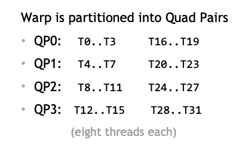
</p>

编程Tensor Core的两种方式

1. 使用PTX级别的`mma.sync.m8n8k4`编程Tensor Core

    - 在Volta GPU上，tensor core对矩阵乘法支持的硬件功能可以通过`mma.sync.m8n8k4`PTX指令来调用。
    - warp中每8个线程为一个Quad-Pair（QP），如上图所示。每个QP协作执行一个`mma.sync.m8n8k4`。
    - 半精度`mma.sync.m8n8k4`要求quad-pair中的每个线程拥有输入矩阵的一个fragment，每一个fragment包含4个半精度浮点数（**4这个magic number从哪里来**？）。
    - 于是，一个quad-pair会拥有input matrix $A$和$B$大小为$8 \times 4$和大小为$4 \times 8$fragments，大小为$8 \times 8$大小的结果矩阵会分散于8个线程内（每一个线程拥有accumulator matrix的一个fragment，称作一个accumulator fragment），每一个的大小是$1 \times 8$。

<p align="center">
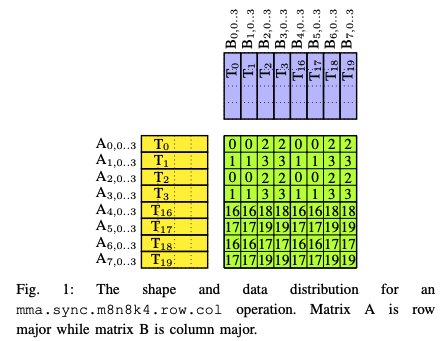<br>Fig. 一个`mma.sync.m8n8k4`计算，fragments的分布。
</p>

假设一个warp执行tensor core的 `mma.sync.m8n8k4` 指令$C=A*B$，矩阵$A$和$B$的类型是`half`，`C`的类型是`float32`。32个线程每4个一组，称为一个quad-pair。一个warp能同时计算4个 `mma.sync.m8n8k4`操作。上图显示的是**一个mma操作**fragments在线程之间的分布。

$A$矩阵的fragment行优先，$B$ 矩阵fragment列优先。每一个线程访问$A$中4个半精度数（2个32位通用寄存器），$B$中的4个半精度（2个32位通用寄存器），$C$中的2个单精度（2个32位通用寄存器）。

2. 使用CUDA 的`wmma` API。与PTX `mma.sync.m8n8k4` 指令不同，`wmma`是一个warp-level API，定义于整个warp之上。一个`wmma`fragments如何分布于线程之间是透明并且是target-independent的。

## Shared Memory 访问的Bank Conflict问题

为了最大化硬件资源的使用（最大化访存带宽，最大化浮点数计算等），我们先来看看一些需要遵守的限制：

1. 为了最大化利用访存带宽，固定使用128b向量化指令访问数据。当输入Tensor的元素类型不同是，一次访问读取的元素个数会不同：$$\text{kElementPerAccess} = \frac{128}{\text{ElementSize}}$$ (这里的ElementSize以bit数计数，half = 16, float32 = 32, float64 = 64)。
2. 在shared memory上存储时，contiguous dimension应对齐到shared memory cache line 位宽：128 bytes。每次访问，**<ins>每个线程都以$\text{kAccessSiee}=128 \text{b}$向量化指令读写数据</ins>**，于是填满一个cache line需要$\text{kTileShapeContiguous}=8$次`128b`的向量化访存 ~~（或者说，这么多个线程协作工作）~~ :$$\text{kTileShapeContiguous}=\frac{\text{Shared Memory Cache Line Width (Bytes)}}{\text{Vectoried Access Width (bits)} / 8}=\frac{128}{128/8}=8$$

shared meomory以4字节（默认4字节，可以配置成8字节）为一个bank，共32个bank。同一个warp中的线程访问不同位宽的数据时，会有不同行为：

<font color=blue>Bank conflicts发生在处于同一个阶段中的合作线程之中，而不是一个warp的所有线程之间</font>。

1. 每个线程访问shared memory中32b数据（两个半精度，一个单精度浮点数，每个线程访问1个bank）
    - 访存在一个阶段完成（4个线程访问128b数据，共8组，**1024b**数据）。<font color=red>$\leftarrow$要避免连续的32个线程读写同一个bank</font>
2. 每个线程访问shared memory中64b数据（四个半精度，两个单精度，一个双精度浮点数，每线程访问2个bank），访存在两个阶段完成：
    - 前16个线程共访问**1024b**数据 <font color=red>$\leftarrow$要避免连续的16个线程读写同一个bank</font>
    - 后16个线程共访问**1024b**数据
3. <ins>每个线程访问shared memory中128b数据（八个半精度，四个单精度，两个双精度，每线程访问4个bank），**访存会在四个阶段完成**</ins>：
    - 每阶段由8个线程共访问**1024b**数据  <font color=red>$\leftarrow$要避免连续的8个线程读写同一个bank</font>

## Swizzled Layout

<p align="center">
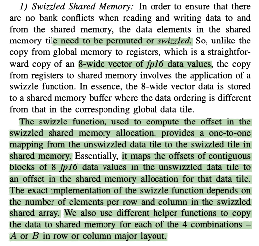
</p>

<p align="center">
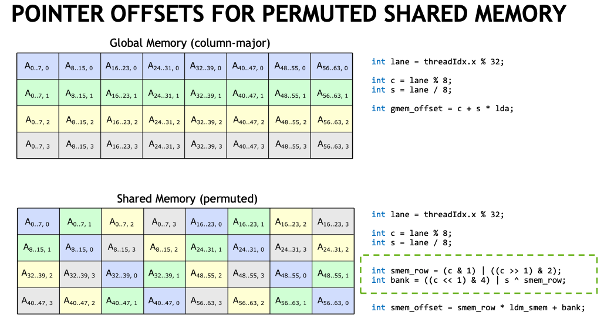
</p>

<p align="center">
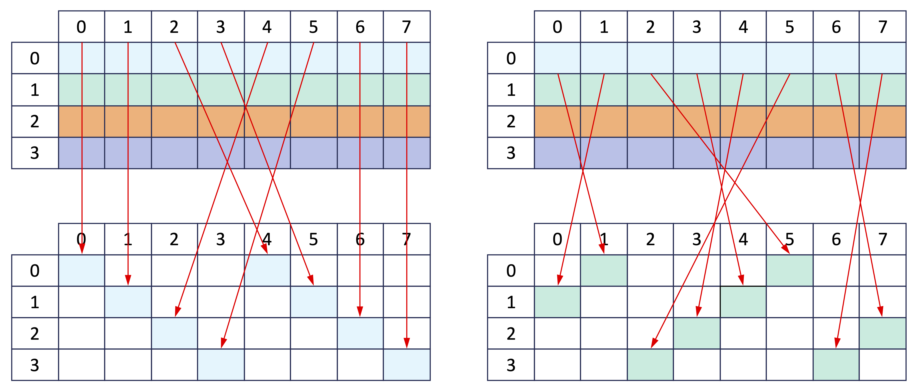
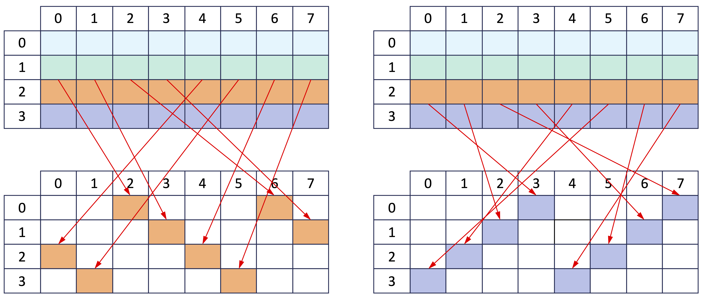
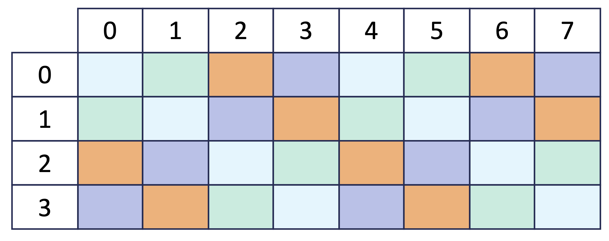
</p>

## Cutlass TensorOpMultiplicand Layout的一些注解

```TensorOpMultiplicand Layout``` 是shared memory上会用到的一种swizzled layout。

<p align="center">
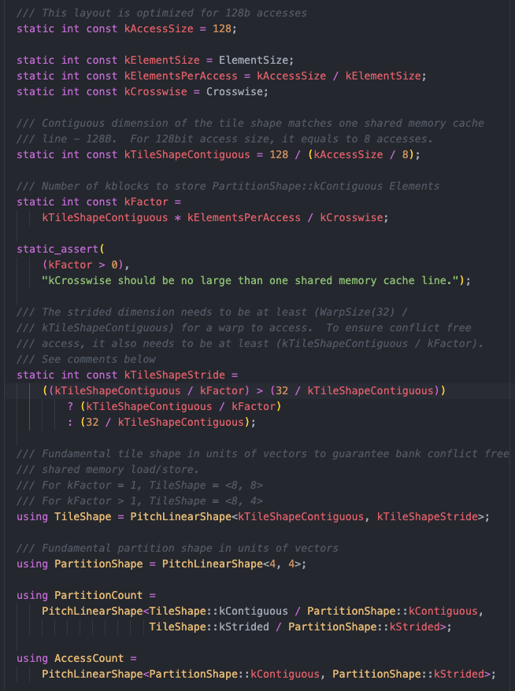
<p>

我们从代码来看一下$\text{kCrosswise}$的行为：
$$\text{kFactor}=\frac{\text{kTileShapeContiguous}*\text{kElementPerAccess}}{\mathbf{kCrosswise}}$$

从这个公式我们能得到`Crosswise`这个参数的实际物理意义：**Shared Memory cache line 的宽度是128 Byte。$\text{kCrosswise}$是以元素个数（不是bits数，不是bytes数）来计数，连续`Crosswise`个元素分为一组，将一个shared memory cache line分成了$\text{kFactor}$组。**

1. shared memory layout中的contiguous dimension一定占据了cache line的整数倍大小，并且需要考虑到一个warp中的32个线程会协作地访问数据，于是当32个线程一起协作访问数据时，**最少**会跨越shared memory中**4个**cache line，也就是下面的$\text{count}_1$。

  $$\#\text{count}_1 = \frac{32}{\text{kTileShapeContiguous}}=4$$

2. 我们再来考虑，如果$\text{kCrosswise}$个元素由一个线程循环访问，每个线程需要循环访问$\text{count}_2$次：

  $$\#\text{count}_2 = \frac{\text{kTileShapeContiguous}}{\text{kFactor}} = \frac{\text{kTileShapeContiguous}*\text{kCrosswise}}{\text{kTileShapeContiguous}*\text{kElementPerAccess}}=\frac{\text{kCrosswise}}{\text{kElementPerAccess}}$$

$\text{kTileShapeStride}$取$\text{count}_1=4$（固定值）和$\text{count}_2$中的较大值。从代码的注释看$\frac{\text{kCrosswise}}{\text{kElementPerAccess}}=\text{kTileShapeStride}$只有4和8两种取值（cache line不分组时取8，分组时取4）。如果取到8只能通过设置$\frac{\text{kCrosswise}}{\text{kElementPerAccess}}=8$，那么我们可以反推出来如何设置$\text{kCrosswise}$: $$\text{kCrosswise}=8*\text{kElementPerAccess}$$


||$\text{kElementPerAccess}$|$\text{kCrosswise}$|$\text{kCrosswise}$|
|:--|:--|:--|:--|
|half|$\frac{128}{16}=8$|$8*8=64$|$8*4=32$|
|float32|$\frac{128}{32}=4$|$4*8=32$|$4*4=16$|
|float64|$\frac{128}{64}=2$|$2*8=16$|$2*4=8$|

<p align="center">
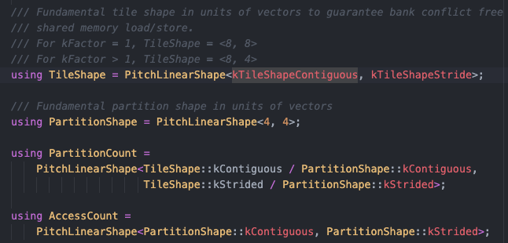
</p>

## 一个具体的例子

<p align="center">
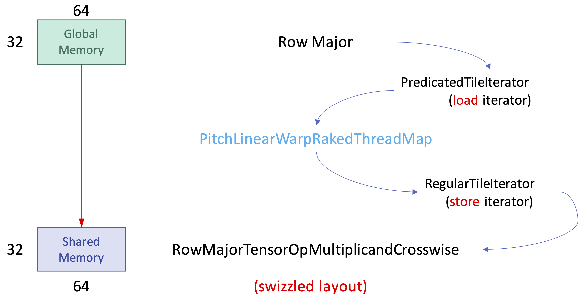
</p>

|参数名|解释|取值示例<br>（$A$,$B$,$C$均为half）|Storage|
|:--|:--|:--:|:--|
|`WholeShape`|矩阵乘的大小|<32,32,64>|Global Memory|
|`ThreadBlockShape`|每个ThreadBlock中所有线程计算的矩阵乘大小|<32,32,64>|Shared Memory|
|`WarpShape`|一个Warp计算的矩阵乘的大小|<32,32,16>|Register|
|`InstructionShape`|wmma操作的矩阵乘大小|<16,8,8>|Register|

一个CTA中所有线程协作将一块大小为$M \times N$的数据从源（Global Memory）搬运到目标（Shared Memory），需要定义：

1. 源数据的Layout，目标数据的Layout。目标数据存储在shared memory上时需要特殊的swizzled layout来避免warp中的线程合作计算时产生bank confilit。
1. 源数据的load iterator，目标数据的store iterator

### Global Memory Layout

RowMajor, ColumnMajor

和PitchLinear`系列的行为很类似，由contiguous（和leading dimension一个意思，数据存储时的最内层维度）和strided两个维度描述。

|Layout|contiguous dimension|strided dimension|
|:--|:--|:--|
|行优先时|列|行|
|列优先时|行|列|

### Shared Memory Swizzled Layout

这里只讨论目前用到的两种swizzled layout，要注意，这两种Layout在cutlass中都只为`128b`向量化访问而优化，也就是说一个线程一次访存读取`128b`数据（一次读取8个半精度，4个单精度，2个双精度）。

1. `RowMajorTensorOpMultiplicandCrosswise<ElementInBits,Crosswise>`
2. `ColumnMajorTensorOpMultiplicandCrosswise<ElementInBits,Crosswise>`

```cpp
using ThreadMap = cutlass::transform::PitchLinearWarpRakedThreadMap<
    cutlass::layout::PitchLinearShape<ThreadblockShape::kM,  /*contiguous*/
                                      ThreadblockShape::kK>, /*tile shape*/
    kThreads /*num_threads*/,
    cutlass::layout::PitchLinearShape<4, 8> /*warp arrangement*/,
    element_per_access /*element per access*/>;
```

`PitchLinearWarpRakedThreadMap`是tenosr core kernels使用的ThreadMap类。在特化这个模板类时，对应上面的代码需要指定以下参数：
1. 搬运数据的大小
1. CTA中的线程数
1. warp中线程布局的形状
1. 每个线程搬运多少个元素：**注意，这里是以元素个数计数，因为我们使用的Layout为128b访存进行了优化元素个数为**:
    
    ```cpp
    const int kAccessInBits = 128;
    const int element_per_access =
        kAccessInBits / cutlass::sizeof_bits<ElementType>::value;
    ```

```cpp
template <
  typename Shape,
  typename Element,
  typename Layout,
  int AdvanceRank,
  typename ThreadMap,
  int AccessSize = ThreadMap::kElementsPerAccess,
  bool Gather = false
>
class PredicatedTileIterator;
```

```PredicatedTileIterator```会针对各种Layout进行特化。**每个线程读到一个二维的数据，但是被flatten成一维Array存储在一个Fragment中**（cutlass中的Fragment是存储在寄存器上的Array），一个Fragment大小按照如下方式计算：

```cpp
// Fragment object to be loaded or stored
using Fragment = cutlass::Array<Element, ThreadMap::Iterations::kCount * ThreadMap::kElementsPerAccess>;

// Fragment 如何计算出来

/// Internal details made public to facilitate introspection
struct Detail {
  /// Fixed arrangement of threads within a warp (units of threads).
  using WarpThreadArrangement = WarpThreadArrangement_;

  /// Number of threads per warp
  static int const kWarpSize = WarpThreadArrangement::kCount;

  /// Number of participating warps
  static int const kWarpCount = kThreads / kWarpSize;

  /// Compute the 'shape' of the overall tile in units of vectors
  using ShapeInAccesses = layout::PitchLinearShape<
    Shape::kContiguous / kElementsPerAccess,
    Shape::kStrided
  >;

  // Divide it into the number of warps, first partitioning the strided dimension then the
  // contiguous.
  static int const kWarpsStrided =
      (WarpAccessIterations::kStrided >= kWarpCount
           ? kWarpCount
           : WarpAccessIterations::kStrided);

  static int const kWarpsContiguous =
      (kWarpCount > WarpAccessIterations::kStrided
           ? kWarpCount / kWarpsStrided
           : 1);

  /// Arrangement of warps within a threadblock-scoped tile
  using WarpArrangement = layout::PitchLinearShape<
    kWarpsContiguous, kWarpsStrided
  >;
};

///< Iterations along each dimension (concept: PitchLinearShape)
using Iterations = layout::PitchLinearShape<
  Detail::WarpAccessIterations::kContiguous / Detail::kWarpsContiguous,
  Detail::WarpAccessIterations::kStrided / Detail::kWarpsStrided
>;
```

我们来运行cutlass [visualize_layout](https://github.com/NVIDIA/cutlass/tree/main/examples/03_visualize_layout)这个例子，来可视化swizzling之后的layout：

`TensorOpMultiplicand<16,32>`对应着：单元素占`16b`（半精度），连续32个元素一组，于是一个cache line被分成$\frac{128}{16/8 * 32}=2$组

```bash
ζ ./03_visualize_layout "TensorOpMultiplicand<16,32>" --extent=32,32 --vectorize=8 --output-shape=64,4   [a09a1b1f] 
# 下面的每一块（4行）是warp中8个线程的一个阶段访存
# warp中的32个线程访存分4个阶段完成，要保证这四个访存阶段在任何数据类型下都没有bank conflicts
(0..7, 0)|(8..15, 0)|(16..23, 0)|(24..31, 0)|(0..7, 1)|(8..15, 1)|(16..23, 1)|(24..31, 1)  # 一条cache line, 128B
(8..15, 2)|(0..7, 2)|(24..31, 2)|(16..23, 2)|(8..15, 3)|(0..7, 3)|(24..31, 3)|(16..23, 3)  # 一条cache line, 128B
(16..23, 4)|(24..31, 4)|(0..7, 4)|(8..15, 4)|(16..23, 5)|(24..31, 5)|(0..7, 5)|(8..15, 5)  # 一条cache line，128B
(24..31, 6)|(16..23, 6)|(8..15, 6)|(0..7, 6)|(24..31, 7)|(16..23, 7)|(8..15, 7)|(0..7, 7)  # 一条cache line，128B

(0..7, 8)|(8..15, 8)|(16..23, 8)|(24..31, 8)|(0..7, 9)|(8..15, 9)|(16..23, 9)|(24..31, 9)
(8..15, 10)|(0..7, 10)|(24..31, 10)|(16..23, 10)|(8..15, 11)|(0..7, 11)|(24..31, 11)|(16..23, 11)
(16..23, 12)|(24..31, 12)|(0..7, 12)|(8..15, 12)|(16..23, 13)|(24..31, 13)|(0..7, 13)|(8..15, 13)
(24..31, 14)|(16..23, 14)|(8..15, 14)|(0..7, 14)|(24..31, 15)|(16..23, 15)|(8..15, 15)|(0..7, 15)

(0..7, 16)|(8..15, 16)|(16..23, 16)|(24..31, 16)|(0..7, 17)|(8..15, 17)|(16..23, 17)|(24..31, 17)
(8..15, 18)|(0..7, 18)|(24..31, 18)|(16..23, 18)|(8..15, 19)|(0..7, 19)|(24..31, 19)|(16..23, 19)
(16..23, 20)|(24..31, 20)|(0..7, 20)|(8..15, 20)|(16..23, 21)|(24..31, 21)|(0..7, 21)|(8..15, 21)
(24..31, 22)|(16..23, 22)|(8..15, 22)|(0..7, 22)|(24..31, 23)|(16..23, 23)|(8..15, 23)|(0..7, 23)

(0..7, 24)|(8..15, 24)|(16..23, 24)|(24..31, 24)|(0..7, 25)|(8..15, 25)|(16..23, 25)|(24..31, 25)
(8..15, 26)|(0..7, 26)|(24..31, 26)|(16..23, 26)|(8..15, 27)|(0..7, 27)|(24..31, 27)|(16..23, 27)
(16..23, 28)|(24..31, 28)|(0..7, 28)|(8..15, 28)|(16..23, 29)|(24..31, 29)|(0..7, 29)|(8..15, 29)
(24..31, 30)|(16..23, 30)|(8..15, 30)|(0..7, 30)|(24..31, 31)|(16..23, 31)|(8..15, 31)|(0..7, 31)
```
<p align="center">
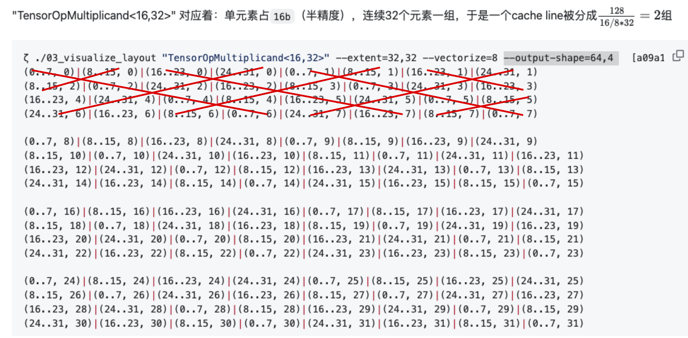
</p>

`TensorOpMultiplicand<16,64>`对应着：单元素占`16b`（半精度），连续64个元素一组，于是一个cache line被分成$\frac{128}{16/8 * 64}=1$组

```bash
ζ ./03_visualize_layout "TensorOpMultiplicand<16,64>" --extent=64,16 --vectorize=8 --output-shape=64,4   [a09a1b1f] 
(0..7, 0)|(8..15, 0)|(16..23, 0)|(24..31, 0)|(32..39, 0)|(40..47, 0)|(48..55, 0)|(56..63, 0)
(8..15, 1)|(0..7, 1)|(24..31, 1)|(16..23, 1)|(40..47, 1)|(32..39, 1)|(56..63, 1)|(48..55, 1)
(16..23, 2)|(24..31, 2)|(0..7, 2)|(8..15, 2)|(48..55, 2)|(56..63, 2)|(32..39, 2)|(40..47, 2)
(24..31, 3)|(16..23, 3)|(8..15, 3)|(0..7, 3)|(56..63, 3)|(48..55, 3)|(40..47, 3)|(32..39, 3)

(32..39, 4)|(40..47, 4)|(48..55, 4)|(56..63, 4)|(0..7, 4)|(8..15, 4)|(16..23, 4)|(24..31, 4)
(40..47, 5)|(32..39, 5)|(56..63, 5)|(48..55, 5)|(8..15, 5)|(0..7, 5)|(24..31, 5)|(16..23, 5)
(48..55, 6)|(56..63, 6)|(32..39, 6)|(40..47, 6)|(16..23, 6)|(24..31, 6)|(0..7, 6)|(8..15, 6)
(56..63, 7)|(48..55, 7)|(40..47, 7)|(32..39, 7)|(24..31, 7)|(16..23, 7)|(8..15, 7)|(0..7, 7)

(0..7, 8)|(8..15, 8)|(16..23, 8)|(24..31, 8)|(32..39, 8)|(40..47, 8)|(48..55, 8)|(56..63, 8)
(8..15, 9)|(0..7, 9)|(24..31, 9)|(16..23, 9)|(40..47, 9)|(32..39, 9)|(56..63, 9)|(48..55, 9)
(16..23, 10)|(24..31, 10)|(0..7, 10)|(8..15, 10)|(48..55, 10)|(56..63, 10)|(32..39, 10)|(40..47, 10)
(24..31, 11)|(16..23, 11)|(8..15, 11)|(0..7, 11)|(56..63, 11)|(48..55, 11)|(40..47, 11)|(32..39, 11)

(32..39, 12)|(40..47, 12)|(48..55, 12)|(56..63, 12)|(0..7, 12)|(8..15, 12)|(16..23, 12)|(24..31, 12)
(40..47, 13)|(32..39, 13)|(56..63, 13)|(48..55, 13)|(8..15, 13)|(0..7, 13)|(24..31, 13)|(16..23, 13)
(48..55, 14)|(56..63, 14)|(32..39, 14)|(40..47, 14)|(16..23, 14)|(24..31, 14)|(0..7, 14)|(8..15, 14)
(56..63, 15)|(48..55, 15)|(40..47, 15)|(32..39, 15)|(24..31, 15)|(16..23, 15)|(8..15, 15)|(0..7, 15)
```

```bash
ζ ./03_visualize_layout "TensorOpMultiplicand<16,32>" --extent=32,64 --vectorize=8 --output-shape=64,4                                                                               [a09a1b1f] 
(0..7, 0)|(8..15, 0)|(16..23, 0)|(24..31, 0)|(0..7, 1)|(8..15, 1)|(16..23, 1)|(24..31, 1)
(8..15, 2)|(0..7, 2)|(24..31, 2)|(16..23, 2)|(8..15, 3)|(0..7, 3)|(24..31, 3)|(16..23, 3)
(16..23, 4)|(24..31, 4)|(0..7, 4)|(8..15, 4)|(16..23, 5)|(24..31, 5)|(0..7, 5)|(8..15, 5)
(24..31, 6)|(16..23, 6)|(8..15, 6)|(0..7, 6)|(24..31, 7)|(16..23, 7)|(8..15, 7)|(0..7, 7)

(0..7, 8)|(8..15, 8)|(16..23, 8)|(24..31, 8)|(0..7, 9)|(8..15, 9)|(16..23, 9)|(24..31, 9)
(8..15, 10)|(0..7, 10)|(24..31, 10)|(16..23, 10)|(8..15, 11)|(0..7, 11)|(24..31, 11)|(16..23, 11)
(16..23, 12)|(24..31, 12)|(0..7, 12)|(8..15, 12)|(16..23, 13)|(24..31, 13)|(0..7, 13)|(8..15, 13)
(24..31, 14)|(16..23, 14)|(8..15, 14)|(0..7, 14)|(24..31, 15)|(16..23, 15)|(8..15, 15)|(0..7, 15)

(0..7, 16)|(8..15, 16)|(16..23, 16)|(24..31, 16)|(0..7, 17)|(8..15, 17)|(16..23, 17)|(24..31, 17)
(8..15, 18)|(0..7, 18)|(24..31, 18)|(16..23, 18)|(8..15, 19)|(0..7, 19)|(24..31, 19)|(16..23, 19)
(16..23, 20)|(24..31, 20)|(0..7, 20)|(8..15, 20)|(16..23, 21)|(24..31, 21)|(0..7, 21)|(8..15, 21)
(24..31, 22)|(16..23, 22)|(8..15, 22)|(0..7, 22)|(24..31, 23)|(16..23, 23)|(8..15, 23)|(0..7, 23)

(0..7, 24)|(8..15, 24)|(16..23, 24)|(24..31, 24)|(0..7, 25)|(8..15, 25)|(16..23, 25)|(24..31, 25)
(8..15, 26)|(0..7, 26)|(24..31, 26)|(16..23, 26)|(8..15, 27)|(0..7, 27)|(24..31, 27)|(16..23, 27)
(16..23, 28)|(24..31, 28)|(0..7, 28)|(8..15, 28)|(16..23, 29)|(24..31, 29)|(0..7, 29)|(8..15, 29)
(24..31, 30)|(16..23, 30)|(8..15, 30)|(0..7, 30)|(24..31, 31)|(16..23, 31)|(8..15, 31)|(0..7, 31)

(0..7, 32)|(8..15, 32)|(16..23, 32)|(24..31, 32)|(0..7, 33)|(8..15, 33)|(16..23, 33)|(24..31, 33)
(8..15, 34)|(0..7, 34)|(24..31, 34)|(16..23, 34)|(8..15, 35)|(0..7, 35)|(24..31, 35)|(16..23, 35)
(16..23, 36)|(24..31, 36)|(0..7, 36)|(8..15, 36)|(16..23, 37)|(24..31, 37)|(0..7, 37)|(8..15, 37)
(24..31, 38)|(16..23, 38)|(8..15, 38)|(0..7, 38)|(24..31, 39)|(16..23, 39)|(8..15, 39)|(0..7, 39)

(0..7, 40)|(8..15, 40)|(16..23, 40)|(24..31, 40)|(0..7, 41)|(8..15, 41)|(16..23, 41)|(24..31, 41)
(8..15, 42)|(0..7, 42)|(24..31, 42)|(16..23, 42)|(8..15, 43)|(0..7, 43)|(24..31, 43)|(16..23, 43)
(16..23, 44)|(24..31, 44)|(0..7, 44)|(8..15, 44)|(16..23, 45)|(24..31, 45)|(0..7, 45)|(8..15, 45)
(24..31, 46)|(16..23, 46)|(8..15, 46)|(0..7, 46)|(24..31, 47)|(16..23, 47)|(8..15, 47)|(0..7, 47)

(0..7, 48)|(8..15, 48)|(16..23, 48)|(24..31, 48)|(0..7, 49)|(8..15, 49)|(16..23, 49)|(24..31, 49)
(8..15, 50)|(0..7, 50)|(24..31, 50)|(16..23, 50)|(8..15, 51)|(0..7, 51)|(24..31, 51)|(16..23, 51)
(16..23, 52)|(24..31, 52)|(0..7, 52)|(8..15, 52)|(16..23, 53)|(24..31, 53)|(0..7, 53)|(8..15, 53)
(24..31, 54)|(16..23, 54)|(8..15, 54)|(0..7, 54)|(24..31, 55)|(16..23, 55)|(8..15, 55)|(0..7, 55)

(0..7, 56)|(8..15, 56)|(16..23, 56)|(24..31, 56)|(0..7, 57)|(8..15, 57)|(16..23, 57)|(24..31, 57)
(8..15, 58)|(0..7, 58)|(24..31, 58)|(16..23, 58)|(8..15, 59)|(0..7, 59)|(24..31, 59)|(16..23, 59)
(16..23, 60)|(24..31, 60)|(0..7, 60)|(8..15, 60)|(16..23, 61)|(24..31, 61)|(0..7, 61)|(8..15, 61)
```

# Reference

1. [Dissecting Tensor Cores via Microbenchmarks: Latency, Throughput and Numeric Behaviors](https://arxiv.org/pdf/2206.02874.pdf)
2. [OPTIMIZING CUDA APPLICATIONS FOR NVIDIA A100 GPU](https://developer.download.nvidia.com/video/gputechconf/gtc/2020/presentations/s21819-optimizing-applications-for-nvidia-ampere-gpu-architecture.pdf)
3. [PROGRAMMING TENSOR CORES: NATIVE VOLTA TENSOR CORES WITH CUTLASS](https://developer.download.nvidia.com/video/gputechconf/gtc/2019/presentation/s9593-cutensor-high-performance-tensor-operations-in-cuda-v2.pdf)
4. [CUTLASS: CUDA TEMPLATE LIBRARY FOR DENSE LINEAR ALGEBRA AT ALL LEVELS AND SCALES](https://on-demand.gputechconf.com/gtc-cn/2018/pdf/CH8303.pdf)
5. [Demystifying Tensor Cores to Optimize Half-Precision Matrix Multiply](https://www.cse.ust.hk/~weiwa/papers/yan-ipdps20.pdf)
6. [GPU and GPGPU ProgrammingLecture 26: Programming Tensor Cores](https://vccvisualization.org/teaching/CS380/CS380_fall2021_lecture_26.pdf)
7. [Automatic Kernel Generation for Volta Tensor Cores](https://arxiv.org/abs/2006.12645)
