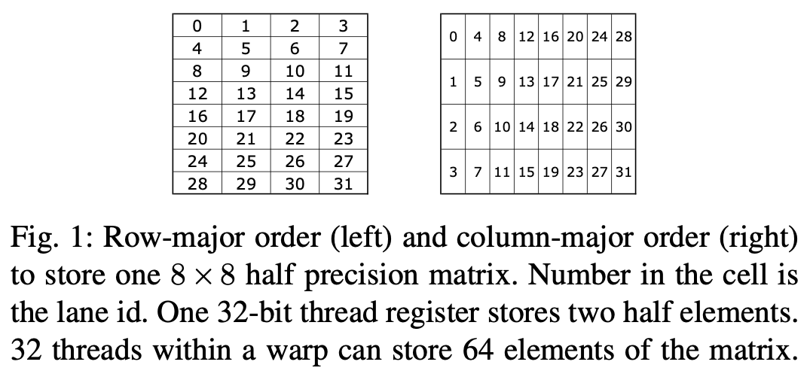

这个[slides](https://developer.download.nvidia.com/video/gputechconf/gtc/2020/presentations/s21745-developing-cuda-kernels-to-push-tensor-cores-to-the-absolute-limit-on-nvidia-a100.pdf)很好地解释了TensorCore指令数据分布情况，这里我们自己通过直接调用`ldmatrix`和`mma`指令做一下简单的观察。

# Tensor Core 指令的数据Distribution

<p align="center">
<br>
warp-level指令的线程组织格式
</p>

warp协作指令中，线程总是以$4\times 8$或$8 \times 4$形状组织


## Tensor Core

>V100中Tensor Core可以聚合的操作八个线程的寄存器，A100则可以操作32个线程的所有寄存器。“A100's enhanced 16x8x16 Tensor Core (TC) instructions improve on V100 by reducing register accesses from 80 to 28, and hardware instructions issued from 16 to 2”

如下图所示，$8 \times 8 \times 128b$ ($m = 8, n = 8, k = 128 \text{b}$) 这样的一个矩阵乘形状是tensor core mma指令的一个基本building block。
 
<p align="center">
<br>
Fig. 1 出自 Ref 3.
</p>

一个warp 内的32线程总是以$4 \times 8$排布进行组织，$4$总是分布在内存中的连续维度之上。

一个$32\text{bit}\ (4 \text{byte})$寄存器可以存储2个半精度浮点数，一个warp 32线程的32-bit寄存器正好可以存储一个$8 \times 8$半精度矩阵 （$32 \times 4 = 128 \ \text{bytes}$ 数据。$8 \times 8 \times 16 / 8 = 128 \ \text{bytes}$），可以被一个warp的32-bit寄存器下，然后用一个index进行数据的寻址。

Tensor core 编程打破了原先CUDA programming model中每个线程寄存器数据是私有的这一情况。Tensor core的MMA指令能同时操作所有lane上的寄存器，所有lane上的寄存器拼在一起存储了一块完整的矩阵乘。
那么下面一个问题是，这个$8 \times 8$矩阵在lanes中是如何scatter的？

tensor core的mma指令要求矩阵乘操作数$A$是行优先，$B$列优先，$C$行优先。$8 \times 8$的矩阵可以行优先或者列优先，两种情况下与lane id对应关系如图1所示。

<p align="center">
<br>
Fig 2. lane ID 与矩阵元素之间的对应关系（出自Ref 6）。
</p>

>the ldmatrix instruction uses a warp (32 threads) to move up to four 8 × 8 matrices from shared memory into the registers of the warp’s threads.

调用ldmatrix时，32线程协作从shared memory协作加载$8\times8$大小的矩阵，每个矩阵元素是16bit的数据。ldmatrix一时钟周期最多可加载4个这样的$8 \times 8$矩阵。以加载4个$8 \times 8$矩阵为例：
- 每个线程用128b向量化访存质量读取shared memory中连续4 bank，8个线程一个shared memory访存事务，32个线程被组成4组，每8线程一组。一个warp 32线程的访问分为4个阶段，每8线程构成一个阶段，shared memory bank conflict发生在这8个线程之中。
- 每个线程访问128数据（8个半精度），后scatter到4个lane上的私有寄存器。

数据分布情况如下图所示：

<p align="center">

</p>

## ldmatrix

```c++
ldmatrix.sync.aligned.shape.num{.trans}{.ss}.type r, [p];

.shape  = {.m8n8};
.num    = {.x1, .x2, .x4};
.ss     = {.shared{::cta}};
.type   = {.b16};
```

### Operand A: 16x16

我们来看一个具体的调用实例，假设要为TCU shape 为$16,8,16$的mma指令feed数据，矩阵$A$和$B$的数据类型均为half。
<p align="center">
<br>
A是16x16的半精度矩阵，ldmatrix一个数据 tile大小是8x8，需要4个这样的基础tile。
</p>

```c++
asm volatile(
     "ldmatrix.sync.aligned.x4.m8n8.shared.b16 {%0, %1, %2, %3}, [%4];\n"
     : "=r"(RA[0]), "=r"(RA[1]), "=r"(RA[2]), "=r"(RA[3])
     : "r"(A_smem_lane_addr));
```

```text
0: 0, 1, 128, 129, 8, 9, 136, 137
1: 2, 3, 130, 131, 10, 11, 138, 139
2: 4, 5, 132, 133, 12, 13, 140, 141
3: 6, 7, 134, 135, 14, 15, 142, 143
4: 16, 17, 144, 145, 24, 25, 152, 153
5: 18, 19, 146, 147, 26, 27, 154, 155
6: 20, 21, 148, 149, 28, 29, 156, 157
7: 22, 23, 150, 151, 30, 31, 158, 159
8: 32, 33, 160, 161, 40, 41, 168, 169
9: 34, 35, 162, 163, 42, 43, 170, 171
10: 36, 37, 164, 165, 44, 45, 172, 173
11: 38, 39, 166, 167, 46, 47, 174, 175
12: 48, 49, 176, 177, 56, 57, 184, 185
13: 50, 51, 178, 179, 58, 59, 186, 187
14: 52, 53, 180, 181, 60, 61, 188, 189
15: 54, 55, 182, 183, 62, 63, 190, 191
16: 64, 65, 192, 193, 72, 73, 200, 201
17: 66, 67, 194, 195, 74, 75, 202, 203
18: 68, 69, 196, 197, 76, 77, 204, 205
19: 70, 71, 198, 199, 78, 79, 206, 207
20: 80, 81, 208, 209, 88, 89, 216, 217
21: 82, 83, 210, 211, 90, 91, 218, 219
22: 84, 85, 212, 213, 92, 93, 220, 221
23: 86, 87, 214, 215, 94, 95, 222, 223
24: 96, 97, 224, 225, 104, 105, 232, 233
25: 98, 99, 226, 227, 106, 107, 234, 235
26: 100, 101, 228, 229, 108, 109, 236, 237
27: 102, 103, 230, 231, 110, 111, 238, 239
28: 112, 113, 240, 241, 120, 121, 248, 249
29: 114, 115, 242, 243, 122, 123, 250, 251
30: 116, 117, 244, 245, 124, 125, 252, 253
31: 118, 119, 246, 247, 126, 127, 254, 255
```

<p align="center">

</p>

### Operand B: 16x8

```text
[0]: 0, 1, 8, 9
[1]: 2, 3, 10, 11
[2]: 4, 5, 12, 13
[3]: 6, 7, 14, 15
[4]: 16, 17, 24, 25
[5]: 18, 19, 26, 27
[6]: 20, 21, 28, 29
[7]: 22, 23, 30, 31
[8]: 32, 33, 40, 41
[9]: 34, 35, 42, 43
[10]: 36, 37, 44, 45
[11]: 38, 39, 46, 47
[12]: 48, 49, 56, 57
[13]: 50, 51, 58, 59
[14]: 52, 53, 60, 61
[15]: 54, 55, 62, 63
[16]: 64, 65, 72, 73
[17]: 66, 67, 74, 75
[18]: 68, 69, 76, 77
[19]: 70, 71, 78, 79
[20]: 80, 81, 88, 89
[21]: 82, 83, 90, 91
[22]: 84, 85, 92, 93
[23]: 86, 87, 94, 95
[24]: 96, 97, 104, 105
[25]: 98, 99, 106, 107
[26]: 100, 101, 108, 109
[27]: 102, 103, 110, 111
[28]: 112, 113, 120, 121
[29]: 114, 115, 122, 123
[30]: 116, 117, 124, 125
[31]: 118, 119, 126, 127
```

<p align="center">

</p>

## mma

```text
[0]: 0.12, 0.32, 1.66, 5.13
[1]: 0.51, 0.70, 8.59, 12.06
[2]: 0.89, 1.08, 15.54, 19.00
[3]: 1.28, 1.47, 22.47, 25.94
[4]: 0.32, 0.92, 1.85, 5.73
[5]: 1.52, 2.12, 9.61, 13.48
[6]: 2.72, 3.32, 17.36, 21.25
[7]: 3.93, 4.53, 25.12, 29.00
[8]: 0.51, 1.52, 2.04, 6.33
[9]: 2.53, 3.54, 10.62, 14.91
[10]: 4.55, 5.56, 19.20, 23.48
[11]: 6.57, 7.59, 27.77, 32.06
[12]: 0.70, 2.12, 2.24, 6.93
[13]: 3.54, 4.96, 11.63, 16.33
[14]: 6.38, 7.80, 21.03, 25.72
[15]: 9.22, 10.64, 30.42, 35.12
[16]: 0.89, 2.72, 2.43, 7.54
[17]: 4.55, 6.38, 12.64, 17.75
[18]: 8.21, 10.04, 22.86, 27.97
[19]: 11.88, 13.70, 33.06, 38.16
[20]: 1.08, 3.32, 2.62, 8.13
[21]: 5.56, 7.80, 13.66, 19.17
[22]: 10.04, 12.28, 24.69, 30.20
[23]: 14.52, 16.77, 35.72, 41.25
[24]: 1.28, 3.93, 2.81, 8.74
[25]: 6.57, 9.22, 14.66, 20.59
[26]: 11.88, 14.52, 26.52, 32.44
[27]: 17.17, 19.81, 38.38, 44.31
[28]: 1.47, 4.53, 3.00, 9.34
[29]: 7.59, 10.64, 15.68, 22.00
[30]: 13.70, 16.77, 28.34, 34.69
[31]: 19.81, 22.89, 41.03, 47.34
MM ref:
[0]:    0.12, 0.32, 0.51, 0.70, 0.89, 1.08, 1.28, 1.47
[1]:    0.32, 0.92, 1.52, 2.12, 2.72, 3.32, 3.93, 4.53
[2]:    0.51, 1.52, 2.53, 3.54, 4.55, 5.56, 6.57, 7.59
[3]:    0.70, 2.12, 3.54, 4.96, 6.38, 7.80, 9.22, 10.64
[4]:    0.89, 2.72, 4.55, 6.38, 8.21, 10.04, 11.87, 13.71
[5]:    1.08, 3.32, 5.56, 7.80, 10.04, 12.28, 14.52, 16.76
[6]:    1.28, 3.93, 6.57, 9.22, 11.87, 14.52, 17.17, 19.82
[7]:    1.47, 4.53, 7.59, 10.64, 13.71, 16.76, 19.82, 22.88
[8]:    1.66, 5.13, 8.60, 12.07, 15.54, 19.00, 22.47, 25.94
[9]:    1.85, 5.73, 9.61, 13.49, 17.37, 21.24, 25.12, 29.00
[10]:   2.04, 6.33, 10.62, 14.91, 19.20, 23.48, 27.77, 32.06
[11]:   2.24, 6.93, 11.63, 16.33, 21.03, 25.72, 30.42, 35.12
[12]:   2.43, 7.54, 12.64, 17.75, 22.86, 27.96, 33.07, 38.18
[13]:   2.62, 8.14, 13.65, 19.17, 24.69, 30.20, 35.72, 41.24
[14]:   2.81, 8.74, 14.66, 20.59, 26.52, 32.44, 38.37, 44.30
[15]:   3.00, 9.34, 15.68, 22.01, 28.35, 34.68, 41.02, 47.36
```

<p align="center">

</p>

# Reference

1. [ldmatrix PTX](https://docs.nvidia.com/cuda/parallel-thread-execution/index.html#warp-level-matrix-instructions-ldmatrix)
1. [swizzling modes](https://docs.nvidia.com/cuda/parallel-thread-execution/index.html#swizzling-modes)
1. [Nvidia Tensor Core-CUDA HGEMM Advanced Optimization](https://bruce-lee-ly.medium.com/nvidia-tensor-core-cuda-hgemm-advanced-optimization-5a17eb77dd85)
1. [DEVELOPING CUDA KERNELS TO PUSH TENSOR CORES TO THE ABSOLUTE LIMIT ON NVIDIA A100](https://developer.download.nvidia.com/video/gputechconf/gtc/2020/presentations/s21745-developing-cuda-kernels-to-push-tensor-cores-to-the-absolute-limit-on-nvidia-a100.pdf)
1. https://github.com/nicolaswilde/cuda-tensorcore-hgemm/tree/master
1. [Warp-level matrix load instruction: ldmatrix](https://docs.nvidia.com/cuda/parallel-thread-execution/index.html#warp-level-matrix-instructions-ldmatrix)
1. [Demystifying Tensor Cores to Optimize Half-Precision Matrix Multiply](https://www.cse.ust.hk/~weiwa/papers/yan-ipdps20.pdf)
1. [NVIDIA A100 Tensor Core GPU Architecture](https://images.nvidia.com/aem-dam/en-zz/Solutions/data-center/nvidia-ampere-architecture-whitepaper.pdf#cid=_pa-srch-baid_zh-cn)
1. https://www.zhihu.com/question/587780273/answer/2929756314
