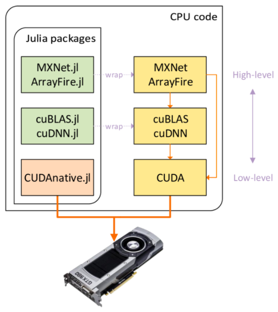

* one of the key principles of Julia’s design is to “build in” as little as possible into the core language, implementing as much as possible of Julia in Julia itself.

<p align="center">
<br>
</p>

# [GPU Computing in the Julia Programming Language](https://devblogs.nvidia.com/gpu-computing-julia-programming-language/)

```julia
using CUDAdrv, CUDAnative

function kernel_vadd(a, b, c)
    i = threadIdx().x
    c[i] = a[i] + b[i]
    return
end

# generate some data
len = 512
a = rand(Int, len)
b = rand(Int, len)

# allocate & upload to the GPU
d_a = CuArray(a)
d_b = CuArray(b)
d_c = similar(d_a)

# execute and fetch results
@cuda (1,len) kernel_vadd(d_a, d_b, d_c)
c = Array(d_c)
```

the `@cuda` macro:

1. generate specialized code for compiling the kernel function to GPU assembly
2. upload the function to the driver
3. prepare the execution environment

---

* On average, the CUDAnative.jl ports <span style="background-color:#A3D1D1;">perform identical to statically compiled CUDA C++</span>.
* Julia has gained support for **[syntactic loop fusion](https://julialang.org/blog/2017/01/moredots)**, where <span style="background-color:#A3D1D1;">chained vector operations</span> are fused into a single broadcast.
* Julia features a strong foreign function interface (FFI) for calling into other language environments.

---

# [Syntactic Loop Fusion](https://julialang.org/blog/2017/01/moredots)

* multiple _**vectorized operations**_ can be “fused” into a single loop, without allocating any extraneous temporary arrays.
  * _**to get good performance both of these snippets <span style="background-color:#A3D1D1;">should be executed inside some function</span>, not in global scope**_ (??).

* `3 .* x .+ y` is equivalent to `(+).((*).(3, x), y)`, and hence it fuses into `broadcast((x,y) -> 3*x+y, x, y)`.
* the fusion stops only when a “non-dot” call is encountered,

To figure out that it could fuse e.g `2*X + Y`, allocate a single array for the result, the compiler would need to do:

1. Deduce the types of `X` and `Y` and figure out what * and + functions to call.
2. Look inside of those functions, realize that they are elementwise loops over `X` and `Y`, and realize that they are [pure](https://en.wikipedia.org/wiki/Pure_function).
3. Analyze expressions like `X[i]`, to detect that they are memory reads/writes and determine what data dependencies they imply (e.g. to figure out that `2*X` allocates a temporary array that can be eliminated).

* _**higher-order functions inline**_

  * In Julia every function has its own type.
  * Whenever you call a function `broadcast(f, x)` (`f` is a function), a specialized version of `broadcast(f, x)` is compiled for `typeof(f)` and `typeof(x`). Since the compiled code is specific to `typeof(f`).
  * to the specific function being passed, the Julia compiler is free to inline `f(x)` into the generated code if it wants to, and all of the function-call overhead can disappear.

---

# [CUDAnative.jl](https://github.com/JuliaGPU/CUDAnative.jl)
