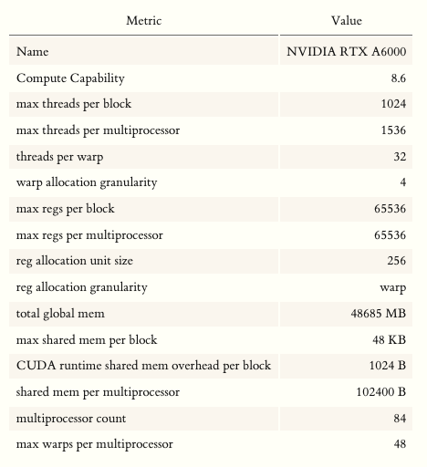
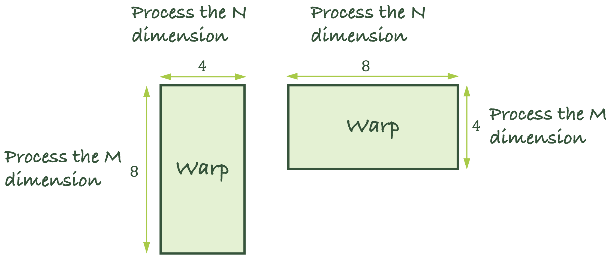
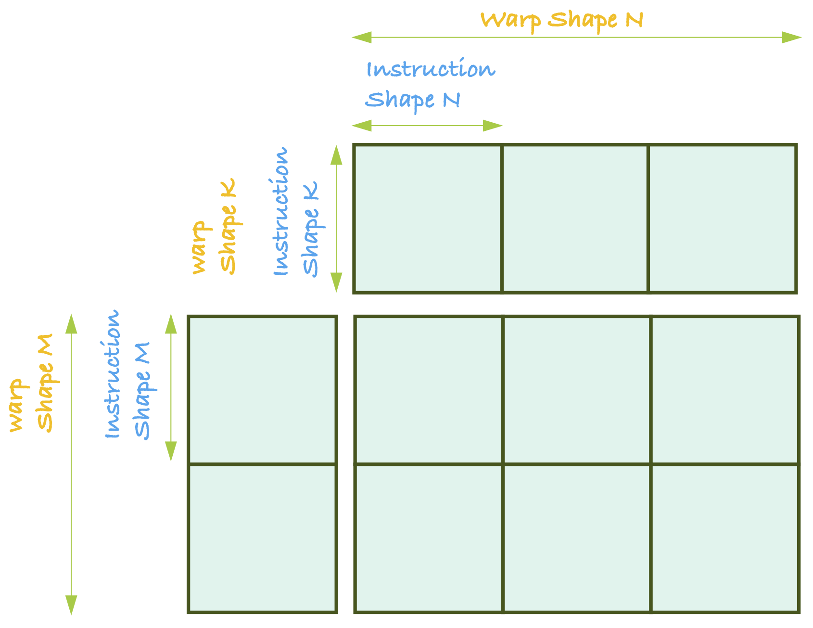
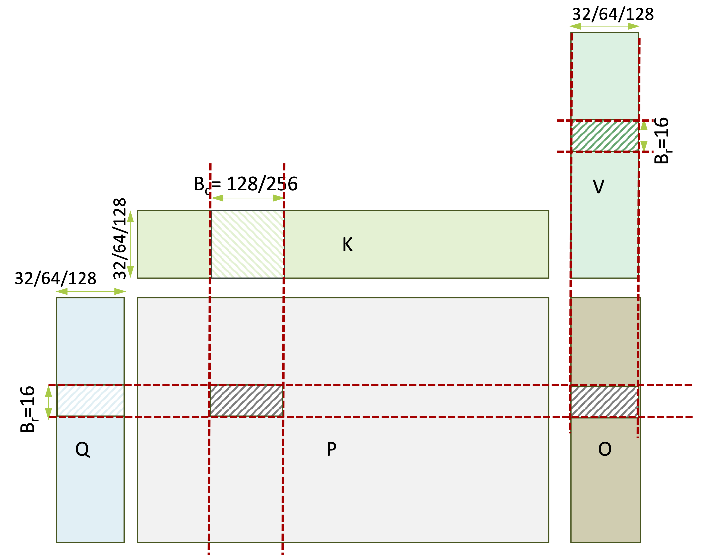

<!-- START doctoc generated TOC please keep comment here to allow auto update -->
<!-- DON'T EDIT THIS SECTION, INSTEAD RE-RUN doctoc TO UPDATE -->
**Table of Contents**  *generated with [DocToc](https://github.com/thlorenz/doctoc)*

- [Flash Attention 代码阅读中的零散笔记](#flash-attention-代码阅读中的零散笔记)
  - [一些准备知识](#一些准备知识)
    - [Occupancy的估算](#occupancy的估算)
    - [矩阵乘分块算法](#矩阵乘分块算法)
    - [内存受限还是计算受限？](#内存受限还是计算受限)
  - [Flash Attention代码中的分块据策略](#flash-attention代码中的分块据策略)
- [References](#references)

<!-- END doctoc generated TOC please keep comment here to allow auto update -->

# Flash Attention 代码阅读中的零散笔记

## 一些准备知识

在理解flash attention代码目前的实现之前，我们先罗列一些基本的背景知识以方便下面的分析。

### Occupancy的估算

GPU utilization可以以occupancy来度量。***occupancy受限于并行线程对片上资源的利用情况***，例如由nvcc这样的device compiler 最终决定的registers分配，和受程序员控制（可编程）的shared memory。一个kernek函数资源利用越多，能启动的并发线程数就越少（occupancy下降），性能有可能降低。

由于on-chip资源十分有限，达到maximal occupancy（所有并发线程都跑起来）实际上非常困难。[查compute capability](https://docs.nvidia.com/cuda/cuda-c-programming-guide/index.html#features-and-technical-specifications)，每代硬件上，每个线程最多使用255个32bit寄存器，编译器也不会为线程分配更多寄存器了。如果以达到maximal occupancy (100%)为目标，一个线程使用的寄存器数目会非常受限。寄存器大多数情况下会成为一个中型kernel的occupancy limiting factor。

保持较高的occupancy是在多数情况下都是一个有用的准则，能够帮助hide lantency。一个kernel实现时，会被下面这三个因素之一限制SM上的实际active warps：寄存器数目，warp数目（并发线程数），shared memory用量。

以我正在使用的A6000为例，通过device query可知，A6000每个block最大shared memory是48K，一个SM有100K shared memory。如果每个block把shared memory用满（48K），那么一个SM最多只能同时调度2个block。如果增大per-block shared memory用量，有可能导致occupancy降低。

>每一代硬件架构支持的每SM最大并发线程数不同，为了能达到理论上100%的occupancy，一个kernel在决定launch config时，block size应该至少被最大并发线程数整除。举例来说，A6000的每SM最大线程数是1536，那么block size选择256/512，计算任务的并发量足够，单kernel消耗的资源少，理论上有可能让SM上所有并发线程跑满。如果选择1024这样的block size，无法被1536整除，那么将无法达到100%的occupancy。

$$occupancy = \frac{\text{active warps数目/SM}}{\text{最大可能active warp数目/SM}}$$

<p align="center">

<br>Fig. 通过device query查询出A6000的基本信息。
</p>

>**NOTE**: 通过cudaGetDeviceProperties API可以查询 **reservedSharedMemPerBlock** （ it is the shared memory reserved by CUDA driver per block in bytes).

任务以block为粒度调度到SM，只要有足够的资源，每个SM会load多个blocks。假设有一个kernel使用资源情况如下：

| 因素                    | 数目   |
|:------------------------|:-------|
| 寄存器数目              | 37     |
| shared memory per block | 8192 B |
| threads per block       | 1024   |

我们按照shared memory，寄存器数目和每block线程数来计算一下每SM上实际active warps：

1. **Shared Memory**: 每个block消耗shared memory数目：$8192 \ \text{B/block} + 1024\  \text{B/block}  = 9216 \ \text{B/block}$。A6000单SM shared memory大小有102400B，那么单SM可以支持load $\lceil 102400 / 9216 \rceil= 11 \ \text{blocks}$。
2. **Threads**: $\lceil 1536 / 1024 \rceil = 1$
3. **Register**: $37 * 32 = 1184\ \text{reg/warp}$。每warp register分配粒度是256，1184取整到1280。每block有1024线程 = 32 warps，于是一个block消耗$1280*32=40960$寄存器。A6000每SM寄存器数目最大是65536，于是能启动$\lceil 65536 / 40960\rceil = 1 \text{block}$。

这样一个kernel，实际active warps受到threads和register的限制，每个SM上只能load一个block，于是估计的 $occupancy = \frac{1024}{32*48} = 66.67\%$。

### 矩阵乘分块算法

我们使用[cutlass中的 Name Convention](https://developer.nvidia.com/blog/cutlass-linear-algebra-cuda/)来复习一下矩阵乘分块算法中三级tile参数的含义。
<p align="center">

<br>Fig. cutlass hierarchical GEMM分块算法的整体流程
</p>

矩阵乘的规模由$M$，$N$，$K$ 三个维度的大小描述，为了高效地利用memory system改善I/O性能，矩阵乘法的高效实现需要做三级tile：

1. **The ThreadBlock Tile$<M_s, N_s, K_s>$**: 每个CTA算$C$矩阵一个大小为$M_s \times N_s$的分块。

   完成$C_{M_s \times N_s}$分块上的计算需要访问$A$矩阵在global memory上$M_s \times K$大小的数据，$B$矩阵在shared memory上$K \times N_s$大小的数据，由于shared memory大小有限，$K$ 维度会进一步以$K_s$大小分为$K/K_s$块。于是，每个Thread Block在$K$维度循环，计算一系列分块上的矩阵乘法（accumulated matrix multiplication）进行累加:
$$C_{M_s \times N_s} += A^i_{M_s \times K_s}B^i_{K_s \times N_s}\qquad i \in [0, K/K_s)$$

    - 当$K$维度不大的时候，Kernel内部以一个串行$for$循环在$K$维度分块上循环，<font color=#CD5C5C>$K_s$越大，kernel内部的串行循环循环次数越少，但是消耗的shared memory也越大。</font>
    - 当$M$和$N$维度较小，$K$维度非常大时。$M$和$N$决定了能启动多少的thread blocks，<font color=#CD5C5C>这时会由于缺少并行性，需要将$K$维度留在kernel内的串行for循环进一步分配给thread block，做block-level的reduction</font>。

当大小为$M_s \times K_s$的$A$分块和大小为$K_s \times N_s$的$B$分块被load到shared memory上之后：

2. **The Warp Tile$<M_r, N_r, K_r>$**: 将第一步中shared memory上的分块进一步分块，每个warp在$K_s$维度循环，计算一系列**外积**，进行累加（$下式中“\times”指外积$）。$$C += A^i \times B^i\qquad i \in [0, K_s)$$

    每个线程束在寄存器上计算$C$ tile 的一个大小为$M_r \times N_r$的分块，访问$A$ tile的一个大小为$M_r \times K_s$的分块，访问$B$ tile一个大小为$N_r \times K_s$的分块。

    一个线程束由32个线程构成，通常有如下图所示的两种二维线程组织形式$[8 \times 4]$或者$[4 \times 8]$：

    假设一个thread block中有$N$个线程，构成了$\frac{N}{32}$个线程束。为了完成矩阵乘计算，这$\frac{N}{32}$个线程以2维方式组织。

<p align="center">

<br>Fig. 线程束中两种二线程组织方式
</p>

3. **Cutlass中Tensor Core MMA的InstructionShape**

    Volta架构之后的GPU增加了专门为DL任务设计的Tensor Core。CUDA 9.0之后提供了warp矩阵（Warp-level Matrix Mulitply and Accumulate）API，可以将Tensor Core上的matrix multiplication and accumulation$D = A × B + C$当作warp级别的操作进行调用。其中的A、B、C、D是一个更大都矩阵的tiles。wmma以warp为单位利用GPU上的Tensor Core进行矩阵乘运算，warp的所有线程可以合作完成在这些tile上的矩阵乘加操作。Tensor Core mma指令处理固定形状的矩阵乘，在不同架构上有所不同。以下信息截取自[cutlass的文档](https://github.com/NVIDIA/cutlass/blob/main/media/docs/functionality.md#warp-level-matrix-multiply-with-tensor-cores):
    
    | **Opcode Class** | **Instruction Shape** | **Warp Shapes**                            |
    |------------------|-----------------------|--------------------------------------------|
    | **TensorOp**     | 8-by-8-by-4           | 32x32x4, 32x64x4, 64x32x4, 64x64x4         |
    | **TensorOp**     | 16-by-8-by-8          | 32x32x8, 32x64x8, 64x32x8, 64x64x8         |
    | **TensorOp**     | 16-by-8-by-16         | 32x32x16, 32x64x16, 64x32x16, 64x64x16     |
    | **TensorOp**     | 8-by-8-by-16          | 32x32x16, 32x64x16, 64x32x16, 64x64x16     |
    | **TensorOp**     | 8-by-8-by-32          | 32x32x32, 32x64x32, 64x32x32, 64x64x32     |
    | **TensorOp**     | 16-by-8-by-32         | 32x32x32, 32x64x32, 64x32x32, 64x64x32     |
    | **TensorOp**     | 16-by-8-by-64         | 32x32x64, 32x64x64, 64x32x64, 64x64x64     |
    | **TensorOp**     | 8-by-8-by-128         | 32x32x128, 32x64x128, 64x32x128, 64x64x128 |
    | **TensorOp**     | 16-by-8-by-256        | 32x32x256, 32x64x256, 64x32x256, 64x64x256 |

    Tensor Core的输入输出是寄存器。矩阵乘操作之前，操作数$A$，$B$和$C$必须加载到寄存器文件中。

    wmma API暴露给Tensor Core的tile大小比Tensor Core每次操作矩阵乘的大小会大一些。每个wmma API的tile需要多个Tensor Core操作才能完成。可以观察上面表格中`TensorOp`的`Instruction Shape`和`Warp Shape`之间的关系：`Warp Shape`的$K$维度和`Instruction Shape`的$K$维度总是一样的，如果使用了Tensor Core wma指令，warp tile也会受到限制。这相当于warp中的合作线程一起完成warp tile大小的矩阵乘法，这样一个矩阵乘法会对$M$和$N$维度进一步分块，而$K$维度不分块。

<p align="center">

<br>Fig. Warp tile和Instruction Shape之间的关系
</p>

### 内存受限还是计算受限？

绘制Roofline model的经验方法：

1. 计算三个量：时间，浮点计算次数（FLOPs），数据移动量（Bytes）
1. 计算AI（x轴）和throughput（y轴）

$$
\begin{align*}
\text{Arithmetic Intensity} &= \frac{\text{FLOPs}}{\text{data moved between fast and slow memory}}\quad \left(\frac{\text{FLOPs}}{\text{Bytes}}\right) \\
\text{Performance} &= \frac{\text{FLOPs}}{\text{time}} \quad \left(\frac{\text{FLOPs}}{\text{time}}\right)
\end{align*}
$$

不断变换setting，描绘出来一系列点。

假设浮点数计算次数为$N_{op}$，内存访问量为$N_{byte}$，计算带宽为$BW_{math}$，内存带宽为$BW_{mem}$，访问内存花费的时间为$T_{mem}$计算花费的时间为$T_{math}$。可以让访存与计算重合，当他们完美重合时总运行时间为$\max (T_{mem},T_{math})$:

$$
\begin{align*}
T_{mem} &= \frac{N_{byte}}{BW_{mem}} \\
T_{math} &= \frac{N_{op}}{BW_{math}}
\end{align*}
$$

- $T_{math} > T_{mem}$ 计算受限 (提高数据复用到一定程度)，下式成立：

$$T_{math} > T_{mem} \rightarrow \frac{N_{op}}{N_{byte}} > \frac{BW_{math}}{BW_{mem}}$$

- $T_{mem} > T_{math}$ 内存受限，下式成立：

$$T_{math} < T_{mem} \rightarrow \frac{N_{op}}{N_{byte}} < \frac{BW_{math}}{BW_{mem}}$$

给定硬件情况下，若算术强度 $>\frac{BW_{math}}{BW_{mem}}$则计算受限，反之为内存受限。以我在使用的三个测试机器为例：

|Precision|[2080Ti](https://www.techpowerup.com/gpu-specs/geforce-rtx-2080-ti.c3305)|[RTX A6000](https://www.techpowerup.com/gpu-specs/rtx-a6000.c3686)|[A100 80G](https://www.techpowerup.com/gpu-specs/a100-pcie-80-gb.c3821)|
|:--:|:--:|:--:|:--:|
|**FP16**|$\frac{27\times 10^{12}}{616\times 10^{9}}=43.83$|$\frac{38.71\times 10^{12}}{768\times 10^{9}}=50.40$|$\frac{78 \times 10^{12}}{1935 \times {10^9}}=40.31$|
|**FP32**|$\frac{13.45 \times 10^{12}}{616\times 10^{9}}=21.83$|$\frac{38.71\times 10^{12}}{768\times 10^{9}}=50.40$|$\frac{20 \times 10^{12}}{1935 \times {10^9}}=10.34$|
|**FP64**|$\frac{420.2\times 10^{9}}{616\times 10^{9}}=0.68$|$\frac{1210\times 10^{9}}{768\times 10^{9}}=1.57$|$\frac{9.8 \times 10^{12}}{1935 \times {10^9}}=5.06$|
|**BF16**|||$\frac{311.84 \times 10^{12}}{1935 \times {10^9}}=161.15$|

对于$A\in \mathbb{R}^{m \times k}$，$B \in \mathbb{R}^{k \times n}$，$C \in \mathbb{R}^{m \times n}$ 这样一个矩阵乘法：
1. 浮点计算次数：$2mnk$
1. 访存次数：$m*k+k*n+m*n$

## Flash Attention代码中的分块据策略

MHA fused的核心将两个矩阵乘的控制结构进行了fuse了。矩阵乘的计算规模由$M$，$N$和$K$三个维度描述。

$$
\begin{align*}
P &= QK \\
O &= OV
\end{align*}
$$

|Dimension|Meaning|
|:--|:--|
|$M_1$|query length|
|$N_1$|key length|
|$K_1$|head dimension|
|$M_2$|query length|
|$N_2$|query length|
|$K_2$|head dimension|

<p align="center">
<br>
Fig. MHA分块示意图
</p>

分块越大shared memory消耗越多，直到能launch的blocks数目减少。

1. $B_c$大，kernel内部的串行循环次数就少。在作者目前的实现中，沿key序列长度维度的分块大小$B_c$只做了两种大小：128，256。
2. query的每个分块都要load整个序列长度的key和value，$B_r$越大，访问key, value 序列的次数就越少。沿query序列长度维度的分块大小$B_r$会影响blocks数目（GPU上blocks以waves调度执行，blocks数目的选择有可能影响尾效应）。

调用cutlass时，矩阵乘法的分块决定时，每个CTA中有多少个线程也已经决定了。

实现的时候launch了`<batch_size, num_heads, num_splits>`个thread blocks。`num_splits`[通过一个简单的启发式策略选择能够最大化occupancy的num_splits](https://github.com/HazyResearch/flash-attention/blob/main/csrc/flash_attn/src/fmha_fwd_launch_template.h#L72)。

入口点在这里[run_fmha_fwd](https://github.com/HazyResearch/flash-attention/blob/main/csrc/flash_attn/fmha_api.cpp#L179)，按照`head_dim`的大小实现了三种kernel：

```cpp
if (launch_params.params.d <= 32) {
    run_fmha_fwd_hdim32(launch_params);
} else if (launch_params.params.d <= 64) {
    run_fmha_fwd_hdim64(launch_params);
} else if (launch_params.params.d <= 128) {
    run_fmha_fwd_hdim128(launch_params);
}
```

这三种kernel的分块策略不同，看`using Kernel_traits =... ` 这里的参数设置。


```cpp
int blocksize_c = head_size > 64 ? 128 : 256;
// Need to round max_seqlen_k to multiples of blocksize_c
int max_seqlen_k = ((max_seqlen_k_ + blocksize_c - 1) / blocksize_c) * blocksize_c;
if( max_seqlen_k_ <= 128 ) {
    max_seqlen_k = 128;
} else if( max_seqlen_k_ <= 256 ) {
    max_seqlen_k = 256;
}
int max_seqlen_q = ((max_seqlen_q_ + 16 - 1) / 16) * 16;
bool loop = max_seqlen_k > blocksize_c;
```

1. GEMM1: $P = QK$

    |head_dim|max $K$ length|$GEMM_1[M,N,K]$|$\text{warps}_M,\text{warps}_N,\text{warps}_K$<br>（number of warps per CTA）|
    |:--:|:--:|:--:|:--:|
    |$32$|$=128$|$16,128,32$|$1,4,1$|
    |$32$|$\ge 256$|$16, 256, 32$|$1,4,1$|
    |$64$|$=128$|$16,128,64$|$1,4,1$|
    |$64$|$\ge 256$|$16,256,64$|$1,4,1$|
    |$128$||$16, 128, 128$|$1,4,1$|

2. GEMM2: $O = KV$

    |head_dim|max $K$ length|$GEMM_2[M,N,K]$|$\text{warps}_M,\text{warps}_N,\text{warps}_K$<br>（number of warps per CTA）|
    |:--:|:--:|:--:|:--:|
    |$32$|$=128$|$16,32,128$|$1,1,4$|
    |$32$|$\ge 256$|$16,32,256$|$1,1,4$|
    |$64$|$=128$|$16,64,128$|$1,1,4$|
    |$64$|$\ge 256$|$16,64,256$|$1,1,4$|
    |$128$||$16, 128, 128$|$1,1,4$|

```cpp
void run_fmha_fwd_hdim32(Launch_params<FMHA_fprop_params> &launch_params) {
    FP16_SWITCH(launch_params.params.is_bf16, ([&] {
        if (launch_params.params.seqlen_k == 128) {
            using Kernel_traits = FMHA_kernel_traits<128, 32, 16, 1, 4, 0x08u, elem_type>;
            run_fmha_fwd_loop<Kernel_traits>(launch_params);
        } else if (launch_params.params.seqlen_k >= 256) {
            using Kernel_traits = FMHA_kernel_traits<256, 32, 16, 1, 4, 0x08u, elem_type>;
            run_fmha_fwd_loop<Kernel_traits>(launch_params);
        }
    }));
}
```

```cpp
void run_fmha_fwd_hdim64(Launch_params<FMHA_fprop_params> &launch_params) {
    FP16_SWITCH(launch_params.params.is_bf16, ([&] {
        if (launch_params.params.seqlen_k == 128) {
            using Kernel_traits = FMHA_kernel_traits<128, 64, 16, 1, 4, 0x08u, elem_type>;
            run_fmha_fwd_loop<Kernel_traits>(launch_params);
        } else if (launch_params.params.seqlen_k >= 256) {
            using Kernel_traits = FMHA_kernel_traits<256, 64, 16, 1, 4, 0x08u, elem_type>;
            run_fmha_fwd_loop<Kernel_traits>(launch_params);
        }
    }));
}
```

```cpp
void run_fmha_fwd_hdim128(Launch_params<FMHA_fprop_params> &launch_params) {
    FP16_SWITCH(launch_params.params.is_bf16, ([&] {
        using Kernel_traits = FMHA_kernel_traits<128, 128, 16, 1, 4, 0x08u, elem_type>;
        run_fmha_fwd_loop<Kernel_traits>(launch_params);
    }));
}
```

```cpp
template<int M, int N, int K, int WARPS_M, int WARPS_N, int WARPS_K>
using Cta_tile_extd = Cta_tile_<M, N, K, WARPS_M, WARPS_N, WARPS_K>;

template<int S, int D, int STEP, int WARPS_M, int WARPS_N, uint32_t FLAGS = 0x08u, typename elem_type_=__half>
struct FMHA_kernel_traits {
    // The CTA description for the 1st GEMM.
    using Cta_tile_p = fmha::Cta_tile_extd<STEP, S, D, WARPS_M, WARPS_N, 1>;
    // The CTA description for the 2nd GEMM.
    using Cta_tile_o = fmha::Cta_tile_extd<STEP, D, S, WARPS_M, 1, WARPS_N>;

    ...
}
```

# References

1. [Understanding Latency Hiding on GPUs](https://www2.eecs.berkeley.edu/Pubs/TechRpts/2016/EECS-2016-143.pdf)
1. [High Performance GPU Tensor Core Code Generation for Matmul Using MLIR](https://mlir.llvm.org/OpenMeetings/2021-08-26-High-Performance-GPU-Tensor-CoreCode-Generation-for-Matmul-Using-MLIR.pdf)
1. 关于Tensor Core mma指令的一些将解释可以在这篇论文[Modeling Deep Learning Accelerator Enabled GPUs](https://arxiv.org/pdf/1811.08309.pdf)中看到
1. [NV_GPU tensor core 算力/带宽/编程模型分析](https://zhuanlan.zhihu.com/p/638129792)
1. [Concurrent execution of CUDA and Tensor cores](https://forums.developer.nvidia.com/t/concurrent-execution-of-cuda-and-tensor-cores/222985/1)
1. [Mechanism behind Roofline Data Collection](https://www.nersc.gov/assets/Uploads/RooflineHack-2020-mechanism-v2.pdf)
