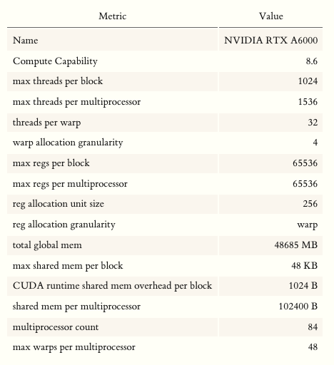

以我正在使用的A6000为例，通过device query可知，A6000每个block最大shared memory是48K，一个SM有100K shared memory。如果每个block把shared memory用满（48K），那么一个SM最多只能同时调度2个block。如果增大per-block shared memory用量，有可能导致occupancy降低。

$$occupancy = \frac{\text{active warps数目/SM}}{\text{最大可能active warp数目/SM}}$$

 Fig. 通过device query查询出A6000的基本信息。

>**NOTE**: 通过cudaGetDeviceProperties API可以查询 **reservedSharedMemPerBlock** （ it is the shared memory reserved by CUDA driver per block in bytes).

保持较高的occupancy是在多数情况下都是有用的准则，能够帮助hide lantency。一个kernel实现时，会被下面这三个因素之一限制SM上的实际active warps：寄存器数目，warp数目，shared memory用量。

任务以block为粒度调度到SM，只要有足够的资源，每个SM会load多个blocks。假设有一个kernel使用资源情况如下：

|因素|数目|
|:--|:--|
|寄存器数目|37|
|shared memory per block|8192 B|
|threads per block|1024|

我们按照shared memory，寄存器数目和每block线程数来计算一下每SM上实际active warps：

1. **Shared Memory**: 每个block消耗shared memory数目：$8192 \ \text{B/block} + 1024\  \text{B/block}  = 9216 \ \text{B/block}$。A6000单SM shared memory大小有102400B，那么单SM可以支持load $\lceil 102400 / 9216 \rceil= 11 \ \text{blocks}$。
2. **Threads**: $\lceil 1536 / 1024 \rceil = 1$
3. **Register**: $37 * 32 = 1184\ \text{reg/warp}$。每warp register分配粒度是256，1184取整到1280。每block有1024线程 = 32 warps，于是一个block消耗$1280*32=40960$寄存器。A6000每SM寄存器数目最大是65536，于是能启动$\lceil 65536 / 40960\rceil = 1 \text{block}$。

这样一个kernel，实际active warps受到threads和register的限制，每个SM上只能load一个block，于是估计的 $occupancy = \frac{1024}{32*48} = 66.67\%$。
