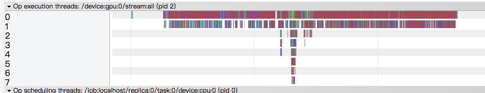

# Test data parallelism on NMT model

## Test Settings

### Environment

- **Test machine 1**
  - TensorFlow r1.8 compiled by gcc 4.9 with Cuda 9.0, cudnn 7.1, NCCL 2.1
    - Cuda driver version: 390.30
  - OS: Ubuntu 16.04.2
  - Tesla P100-PCIE-16GB
    - 8 GPU cards on one machine.

- **Test machine 2**
  - TensorFlow r1.8 compiled by gcc 4.9, with Cuda 9.0, cudnn 7.1, NCCL 2.1
    - Cuda driver version: 384.130
  - OS: Ubuntu 16.04.2
  - GTX Titan
    - 3 GPU cards on one machine

### Test details

- Disable training data shuffle.
- Run 100 mini-batches and count words per second.
- Test codes are base on this commit: [a0a40f0](https://github.com/lcy-seso/dl_framework/tree/a0a40f065ecf9ceb36061c1ef2d749327d051da8/tensorflow/test_parallel_tensorflow)

### Results

- Exp1 on test machine 1

    |GPU number|batch size per GPU|total time (s)|processing speed (words/second)|speed-up ratio|
    |:--|:--|:--|:--|:--|
    |1|128|35.774|17575.180|
    |2|128|47.777|26307.289|1.496|
    |3|128|65.451|28664.074|1.631|
    |4|128|79.782|31361.289|1.784|
    |5|128|95.910|32612.374|1.8556|
    |6|128|107.257|34947.664|1.988|
    |7|128|125.969|34777.809|1.979|
    |8|128|142.747|34930.192|1.987|

    >- **A terrible acceleration ratio.**
    >- **Also terrible GPU utilization is found when the number of GPU cards increase.**

    |GPU number|batch size per GPU|total time (s)|processing speed (words/second)|speed-up ratio|
    |:--|:--|:--|:--|:--|
    |1|350|37.441|23008.795|
    |2|350|48.091|35996.443|1.56|
    |3|350|59.936|42764.000|1.85|

#### Some supplementary tests

Some supplementary tests trying to figure out the reason.

- **all the training data have the same length**

    |GPU number|batch size per GPU|total time to run 50 batches(s)|processing speed (words/second)|speed-up ratio|
    |:--|:--|:--|:--|:--|
    |1|64|34.056|18886.473|
    |2|64|49.559|25956.764|1.374|
    |3|64|69.591|27727.719|1.468|

    |GPU number|batch size per GPU|total time to run 50 batches(s)|processing speed (words/second)|speed-up ratio|
    |:--|:--|:--|:--|:--|
    |1|256|72.002|35732.490|
    |2|256|86.196|59696.820|1.67|
    |3|256|106.602|72403.628|2.026|
    |4|256|124.894|82399.797|2.3|

    |GPU number|batch size per GPU|total time to run 50 batches(s)|processing speed (words/second)|speed-up ratio|
    |:--|:--|:--|:--|:--|
    |1|350|91.303|38525.453|
    |2|350|106.966|65768.860|1.7|
    |3|350|126.576|83368.931|2.1|
    |4|350|148.674|94636.410|2.45|
    |5|350|169.388|103829.613|2.69|

- Exp2 on test machine 2

  >The GPU memory for GTX Titan is limited (6G). It cannot run the model by using a large batch size like 128, so batch size in this test is decreased to 64.

  |GPU number|batch size per GPU|total time (s)|processing speed (words/second)|speed-up ratio|
  |:--|:--|:--|:--|:--|
  |1|64|50.850|6135.506|
  |2|64|59.803|10513.544|1.714|
  |3|64|65.097|14509.607|2.365|

## How to profile

### use TensorFlow profiler

1. Compile `tfprof` (for more details, please follow [this documentation](https://github.com/tensorflow/tensorflow/blob/master/tensorflow/core/profiler/g3doc/command_line.md#build-tfprof))

    - Execute the following command under the tensorflow source directory:

        ```bash
        bazel build --config opt tensorflow/core/profiler:profiler
        ```

    - After the building process is finished, the profiler can be found in: `bazel-bin/tensorflow/core/profiler`.

1. generate timeline vitualization file

    ```bash
    tfprof> graph -step -1 -max_depth 100000 -output timeline:outfile=<filename>
    ```

### virtualize the execution timeline

- on test machine 1, run 5 batches, here virtualize the timeline for batch 3. batch size = 64

  <p align="center">
  
  </p>

  a strange timeline ...

Update:

The reason for such a strange timeline is that, when displaying, Chrome does not distinguish different GPUs. In the above picture, it does not mean each line is a timeline for one GPU card. The profiler records the start timestamp and duration of each monitored event, and try to arrange it in one timeline. Monitored events for multiple GPU cards are mixed together. User needs to process the dumped results (in json format) himself to understand what happened.
