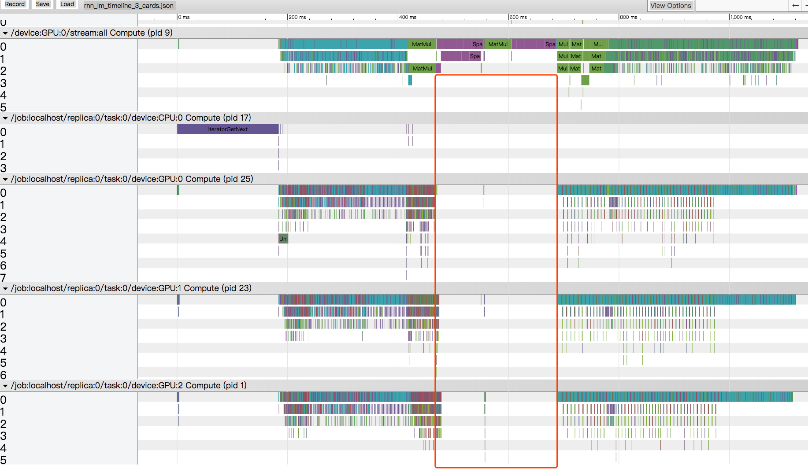

## Test TensorFlow data parallelism on RNNLM

- GTX Titan, 3 cards on one machine.
- Settings (how the test runs):
  1. Run 5 epoches (0, 1, 2, 3, 4), and count the total time that epoch 1, 2 and 3 take.
  1. In the data feeding part:
      - read all the training data into CPU memory at the begining of the training process, so that the time I/O consumes will not count.
      - Fix the data bucket number to 1.
   1. **Dataset shuffle is used this test.**

### Test 1: fix the total batch size

>**This does not frequently happend when using multiple cards.**

- Fix the total batch size, so that the rounds of forward-backward computation and parameter updates in on training epoch are the same.
- But this means, when using multiple GPU cards, the matirx sizes for each card become smaller.

  |GPU number| Total time to run 3 epoches (s) |batch size per card|Total batch size|Speed-up Ratio|
  |--|--|--|--|--|
  |1|43.096173|768| 786 * 1 = 768 ||
  |2|30.948307|384| 384 * 2 = 768 |1.39|
  |3|27.553479|256 | 256 * 3 = 768|1.56|

### Test 2: Fix batch size per card

>**This is often the situation when using the multiple GPU cards: increase the total batch size.**

- This will lead to a very large batch size which potentially (sligthly) harm the learning performance (not always the truth, need carefully tune the hyper parameters.)
- A large batch size means in one epoch forward-backward computation will become less (less parameter updates). The overall computations are slightly reduced.
- A large batch size means when merge gradients, the data communication among GPU cards becomes heavier.

  |GPU number| Total time to run 3 epoches (s) |batch size per card|Total batch size|Speed-up Ratio|
  |--|--|--|--|--|
  |1|45.019466|512|512 * 1 = 768||
  |2|29.178264|512|512 * 2 = 1024|1.54|
  |3|22.716143|512|512 * 3 =  1536|1.98|

### Some points:

1. A proper batch size helps, neither too small nor too large to make best use of GPU's parallel computation power.
2. By using data parallism, it is relatively easy to achieve a more balanced worklaod for each GPU card.
3. Buckets helps to accelerate training speed.
    - But will potentially cause problem for this simple implementation, because `tf.split` are used to split data which requires the batch size can be evenly divided by the number of GPU cards. This cannot be garanteed if construct the buckets by using TensorFlow's dataset API dynamically.

## Some interesting findings

When I use TensorFlow timeline to profile the time performance to find out why there is almost no acceleration when using 3 GPU cards with comparison to using 2 cards.

 

**TensorFlow automatically place the "Softmax" (here when talking about "Softmax" I also include the pre-softmax projection.) to one GPU cards even if in the codes it should be run on all the three cards.** All the cards have to wait GPU 0 to finish the softmax computation (forward and backward).

 **This is strange. Why this happens, I not sure. Need to check**.

>I guess this is because I set [`config.allow_soft_placement = True`]( https://github.com/lcy-seso/dl_framework/blob/master/tensorflow/dataset_api/train.py#L37`) . Unfortunately, this flag has to be set to `True`, otherwise user has to explictly place each operator on an appropriate device and some control flow operator dose not have a GPU kernel. This mannul placement will be too tedious.

## Some other notes:

- I compile TensorFlow r1.5 without NCCL support. From the timeline, it seems that tensorflow uses `gather` to merge gradients.
- Applying parameter updates only be done in the main GPU card (card 0). Theoretically this can also be done in parallel.
