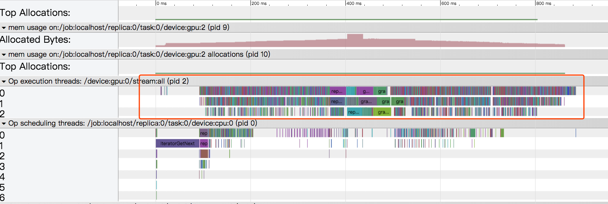

# Test data parallelism on NTM model

## Test environment

- TensorFlow r1.8 compiled with Cuda 9.0, cudnn 7.1, NCCL 2.1
- OS: Description:    Ubuntu 16.04.2 LTS
- GPU Tesla P100-PCIE-16GB

## Test method

- Disable training data shuffle.
- Run 100 mini-batches and count words per second.

## data parallelism

|GPU number|batch size per GPU|total time (s)|processing speed (words/second)|speed-up ratio|
|--|--|--|--|--|
|1|100|31.5574|15917.518289|
|2|100|42.6996|23000.764050|1.445|
|3|100|57.6878|25397.311179|1.59|
|4|100|71.9705|27547.736864|1.73|
|5|100|83.5600|29233.876241|1.83|
|6|100|97.6670|30018.884621|1.88|

## profiling results

1. Compile `tfprof`: execute the following command under the tensorflow source directory:

    ```bash
    bazel build --config opt tensorflow/core/profiler/…
    ```
1. generate timeline vitualization file:

    ```bash
    tfprof> graph -step -1 -max_depth 100000 -output timeline:outfile=<filename>
    ```

<p align="center">

</p>

A not healthy timeline. Need more analysis.
